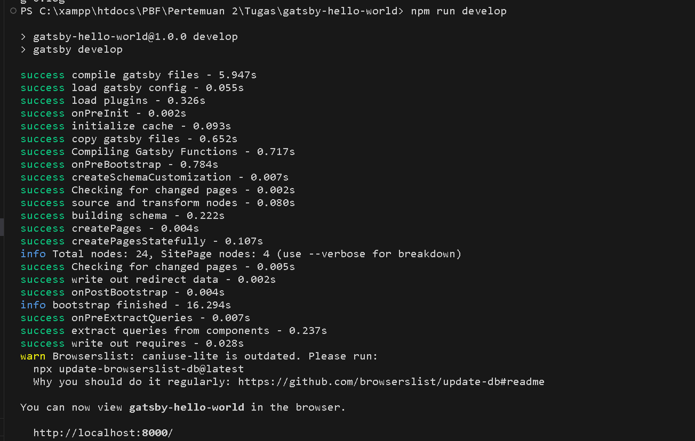

NAMA : Trisinus Gulo

Kelas : TI-3C

Absen : 14

Praktikum 2 : PBF

# Praktikum 

Langkah 1 : 

Buat Folder Baru
Buatlah folder baru bernama belajar-react lalu di dalam folder tersebut, jalankan terminal dengan mengetikkan perintah berikut:

Langkah 2: 

Buat project baru
Buatlah project baru bernama hello-world seperti pada gambar berikut ini:

Soal 1

Pada gambar tersebut, silakan Anda browsing apa yang dimaksud dengan:

- TypeScript adalah bahasa pemrograman open-source yang merupakan superset dari JavaScript. Ini berarti bahwa setiap kode JavaScript valid juga valid dalam TypeScript, tetapi TypeScript menambahkan tipe statis dan beberapa fitur lainnya untuk membantu pengembangan perangkat lunak dalam skala besar.
- ESLint adalah ESLint adalah utilitas analisis statik untuk mengidentifikasi dan memperbaiki pola kode yang tidak konsisten atau tidak diinginkan dalam JavaScript. Ini membantu dalam menjaga kualitas kode dan memastikan keseragaman dalam proyek.
- Tailwind CSS adalah kerangka kerja CSS yang sangat dapat disesuaikan yang memungkinkan pengembang untuk mendesain antarmuka web dengan cepat dengan menggunakan kelas-kelas bawaan yang disediakan oleh Tailwind.
- App Router adalah biasanya merujuk pada sebuah library atau modul dalam sebuah aplikasi web yang bertanggung jawab untuk menangani routing, atau penentuan bagaimana aplikasi harus menanggapi permintaan untuk URL tertentu. Router ini memungkinkan navigasi antara berbagai bagian dari aplikasi web tanpa harus memuat ulang halaman secara keseluruhan.
- Import alias adalah cara untuk memberikan nama yang lebih singkat atau lebih deskriptif untuk modul yang diimpor dalam kode JavaScript atau TypeScript. Ini membantu dalam meningkatkan keterbacaan kode dan mengurangi penulisan kode berulang.

Langkah 3: Buka dengan VS Code

Setelah selesai proses langkah sebelumnya, ketik per baris di terminal seperti berikut untuk masuk ke folder project dan dibuka dengan VS Code.

Soal 2

Pada struktur project tersebut, jelaskan kegunaan folder dan file masing-masing tersebut!

Jawaban:

Folder :

- node_modules: Folder ini berisi modul-modul Node.js yang digunakan oleh project. Modul-modul ini diinstal dengan menggunakan package manager seperti npm atau Yarn.
- public: Folder ini berisi file-file statis yang akan disajikan kepada pengguna, seperti gambar, CSS, dan JavaScript.
- app: Folder ini berisi kode sumber project.

File :

- .eslintrc.json: File ini berisi konfigurasi untuk ESLint, sebuah alat yang membantu untuk memastikan kode JavaScript mengikuti standar gaya yang ditentukan.
- .gitignore: File ini berisi daftar file yang tidak ingin dikomit ke Git.
- next.config.mjs: File ini berisi konfigurasi untuk Next.js, sebuah framework JavaScript untuk membangun aplikasi web statis dan server-side rendered.
- next-env.d.ts: File ini berisi deklarasi tipe untuk variabel lingkungan yang digunakan oleh Next.js.
- package.json: File ini berisi informasi tentang project, seperti nama, versi, dan dependensi.
- package-lock.json: File ini berisi daftar modul Node.js yang diinstal dalam project, beserta versi dan checksumnya.
- postcss.config.js: File ini berisi konfigurasi untuk PostCSS, sebuah alat untuk memproses dan mentransformasi CSS.
- README.md: File ini berisi README project, yang menjelaskan tentang project dan cara menggunakannya.
- tailwind.config.ts: File ini berisi konfigurasi untuk Tailwind CSS, sebuah framework CSS yang membantu untuk membangun user interface yang modern.
- tsconfig.json: File ini berisi konfigurasi untuk TypeScript, sebuah superset dari JavaScript yang menambahkan fitur-fitur seperti tipe statis.

Langkah 4: Run

Sekarang kita coba running project pertama kita dengan menjalankan perintah berikut di terminal VS Code.npm run dev
Tunggu proses kompilasi hingga selesai. Lalu Anda dapat membuka alamat localhost di browser: http://localhost:3000/

**Hasil Output**

Soal 3

Gantilah teks pada bagian atas dengan Nama - NIM Anda. Contoh seperti gambar berikut:

*Penjelasan* :
pada hasil tersebut terjadi perubahan di karenakan telah melakukan modifikasi pada kodingan di file page.tsx jadi teksnya berubah menjadi nama dan Nim ketika di jalankan dan tidak perlu kita npm run dev lagi di browser sendiri akan tampil teks mana yang kita ubah tingga kita refresh browsernya.

**Tugas**
- Remix

  
  
  

- Gatsby
  
  
  

  **perbedaan diantara ketiga framework tersebut (termasuk Next.js)**

  - Next.js Homepage ini menonjolkan fitur-fitur utama framework seperti server-side rendering, static site generation, dan routing dande ngan basis pengguna yang besar, dokumentasi yang luas, dan dukungan komunitas yang kuat menjadi solusi yang dapat diandalkan untuk berbagai kasus penggunaan, cocok untuk proyek-proyek dengan skala besar dan kompleks.
  - Remix Framework kurang lebih seperti next.js proses pengistalannya dan juga saat menjalankanya.remis memiliki tampilan yang cukup sederhana atau masih tahap pengembangan.
  - gatsby tampilannya cukup menarik kayak next.js gatsby ini lebih membuat situs statis yang cukup cepat dan ringan. dan perbedaannya gatsby ini tidak bisa menggunakan dev tapi harusnya menggunakan npm run develop.
  

