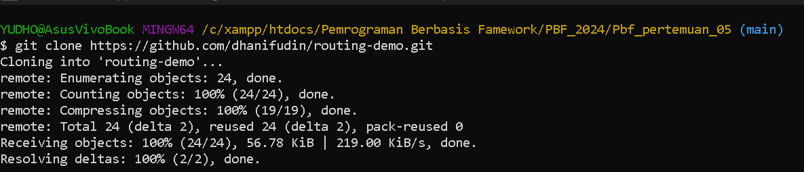
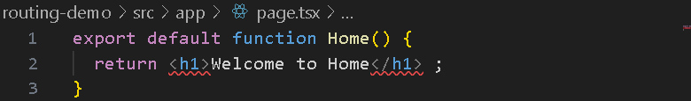
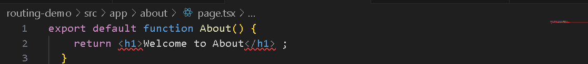
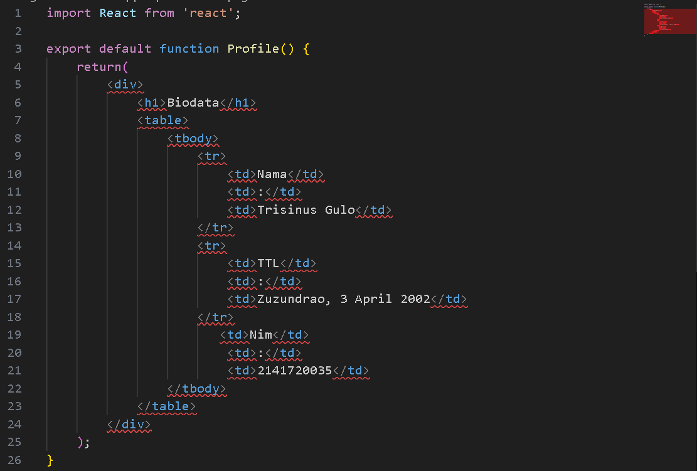
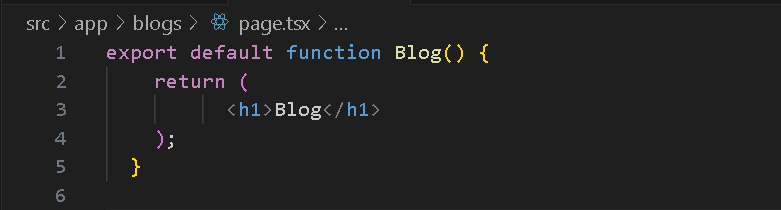
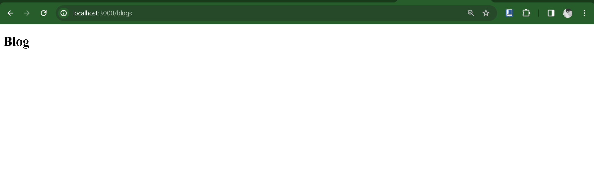
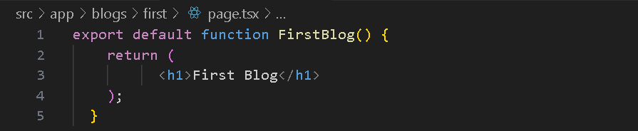

Nama : Trisinus Gulo

Kelas : TI-3C

Absen : 28

Pertemuan 5 : PBF

Praktikum 1 - Membuat routing sederhana

1. Project yang sudah di sediain template di salin linknya terus di clone
   

2. Clone project ke lokal laptop anda dan lakukan instalasi dependencies dengan menjalankan perintah berikut.
   

3. menambahkan file page.tsx di dalam folder app serta membuat komponenya
   
     Home
     
     
     
      About
     
     
     Profile
     
     

<!-- 
Praktikum 2 - Membuat routing bersarang (Nested Routing)
   
     Blogs
     
     
     First Blogs
     
     
     Second 
     
     
    -->
   <!-- kekuarangannya  yang mungkin terjadi jika menggunakan pendekatan pada Praktikum 2 kita perlu menambahkan folder nya dan juga page tsx lainnya sehingga resource tidak maksimal atau tidak terurut perlu menggunakan pege tsx banyak. -->
      

