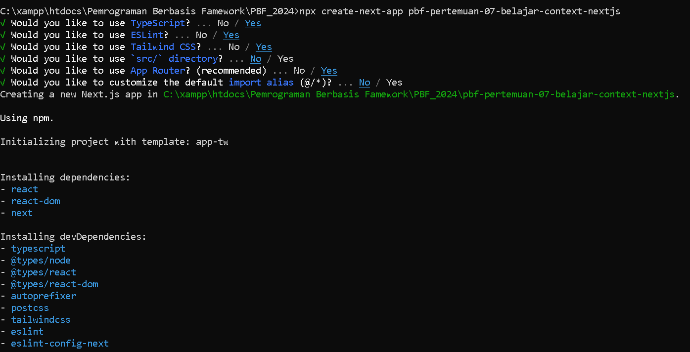
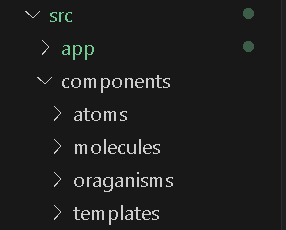
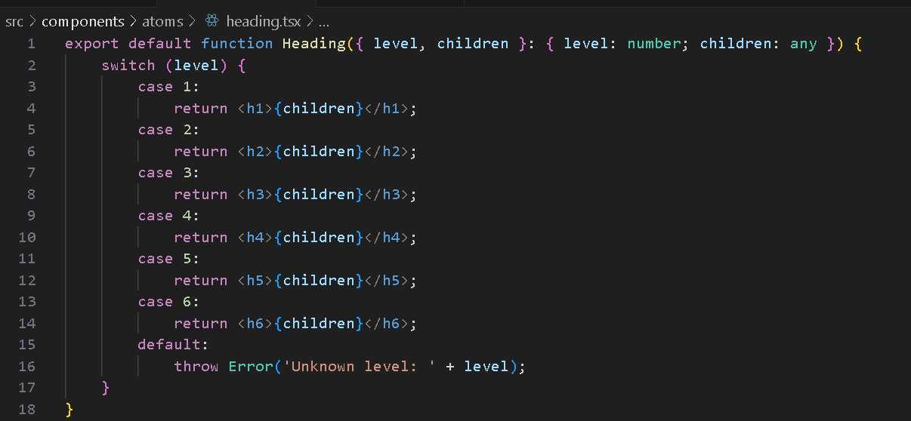
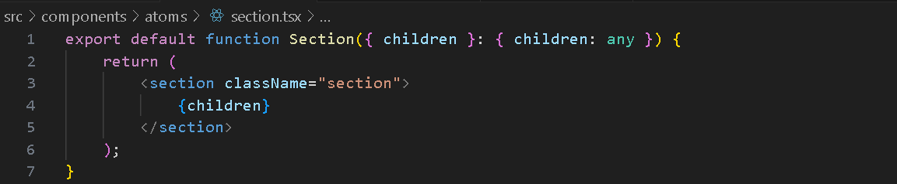
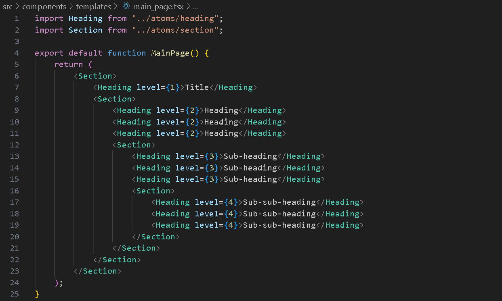
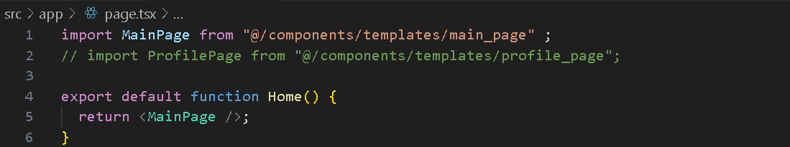

Trisinus Gulo | 2141720035

Praktikum 1 : Membuat Variasi Ukuran Teks Heading dengan Context

Langkah 1: Buat project baru dan repo baru di GitHub


Langkah 2: Buat struktur folder dengan prinsip atomic design
```bash
Buatlah folder baru di src/components seperti berikut ini
```


Langkah 3: Buat komponen atom baru




Langkah 4: Ubah isi kode page.tsx dan run


