Trisinus Gulo | 2141720035

Praktikum 1 : Membuat Variasi Ukuran Teks Heading dengan Context

Langkah 1: Buat project baru dan repo baru di GitHub


Langkah 2: Buat struktur folder dengan prinsip atomic design
```bash
Buatlah folder baru di src/components seperti berikut ini
```


Langkah 3: Buat komponen atom baru


Langkah 4: Ubah isi kode page.tsx dan run


Soal 1
Capture hasilnya dan buatlah laporan di README.md. Jelaskan apa yang telah Anda pelajari dan bagaimana tampilannya saat ini?
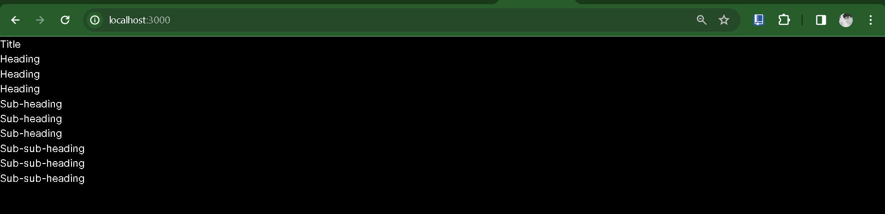
Dengan pendekatan Atomic Design, kita mengorganisir komponen-komponen dalam struktur terstruktur. Kode dapat dipakai ulang, mengurangi duplikasi, dan tampilan yang bervariasi bisa dibuat dengan mudah menggunakan properti dinamis.

Langkah 5.1: Buat Context
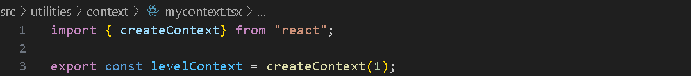

Langkah 5.2: Gunakan context
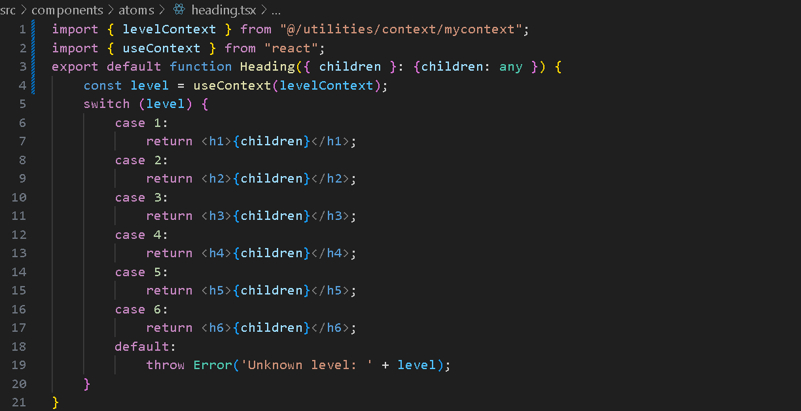
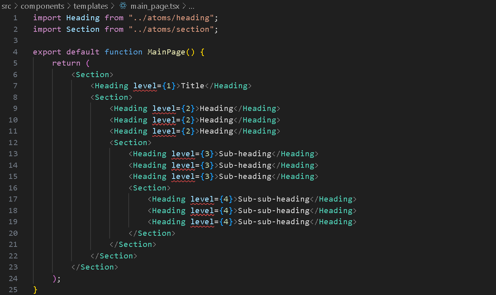

Langkah 5.3: Sediakan context
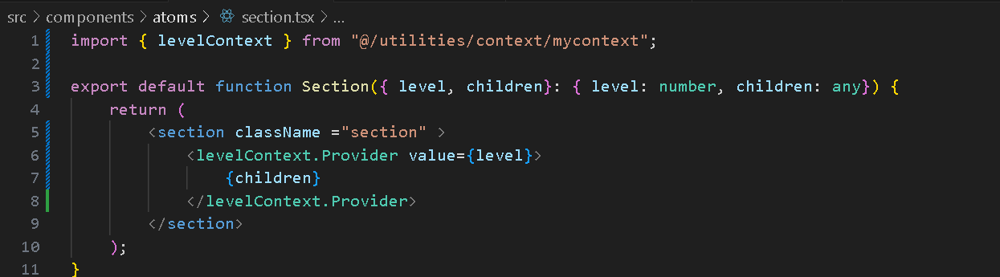
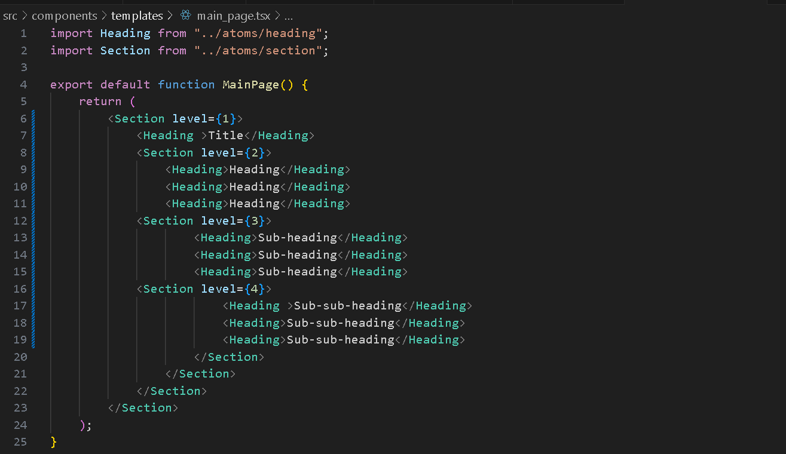


Soal 2
Capture hasilnya dan buatlah laporan di README.md. Jelaskan apa yang telah Anda pelajari dan bagaimana tampilannya saat ini?

Meneruskan nilai antar komponen menggunakan Context memungkinkan komponen-komponen anak mengakses nilai tanpa perlu meneruskannya secara langsung. Meskipun nilai-nilai tersebut tersedia melalui Context, tampilan halaman tetap sama seperti sebelumnya.

Langkah 6: Menggunakan dan menyediakan context dari komponen yang sama
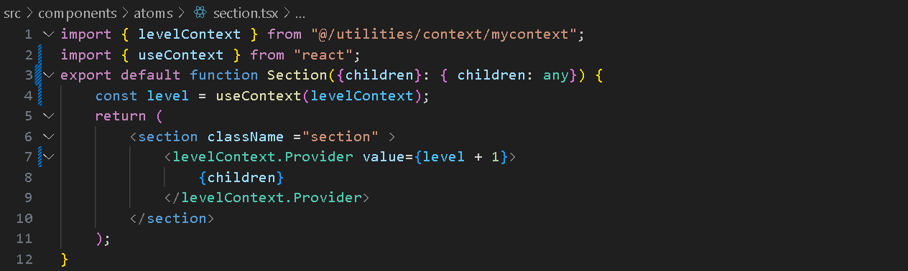
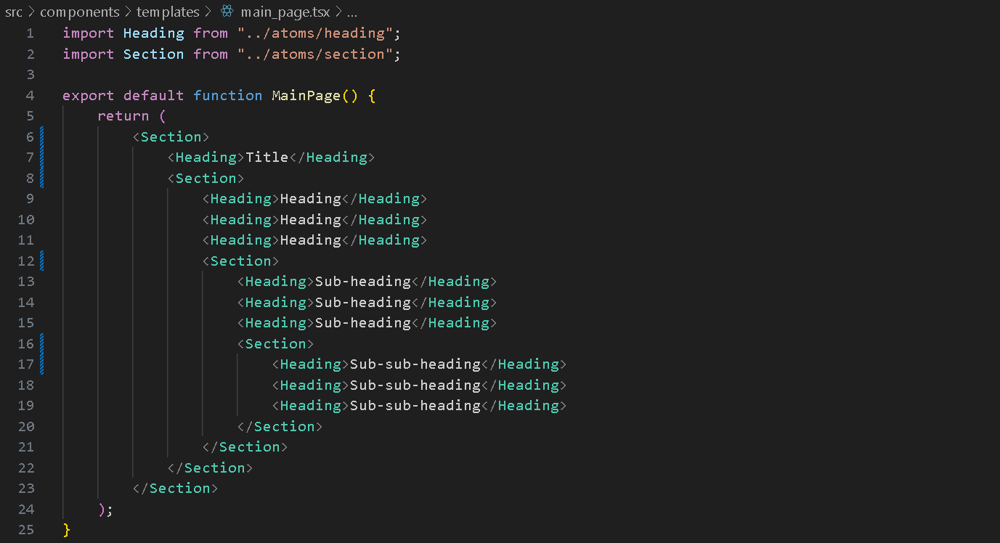
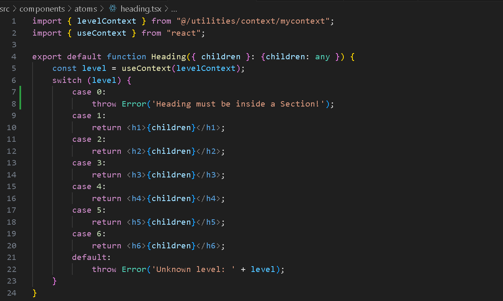

Soal 3
Capture hasilnya dan buatlah laporan di README.md. Jelaskan apa yang telah Anda pelajari dan bagaimana tampilannya saat ini?

Dalam langkah keenam ini, Context digunakan untuk mentransfer data secara otomatis dengan penambahan otomatis. Meskipun ukuran font lebih kecil pada awalnya, nilai tersebut bertambah secara otomatis di setiap level komponen anak, menghasilkan perbedaan visual yang diinginkan. Tujuannya tetap sama: mengirimkan data antar komponen dengan pola atau operasi tertentu tanpa perlu penanganan manual di setiap level.

Praktikum 2: Membuat Context melewati komponen perantara

Langkah 1: Buat komponen atom baru
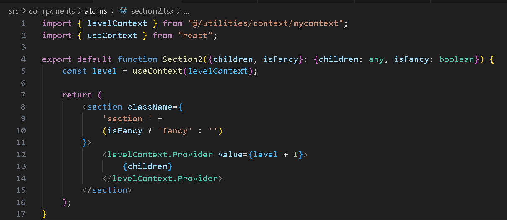
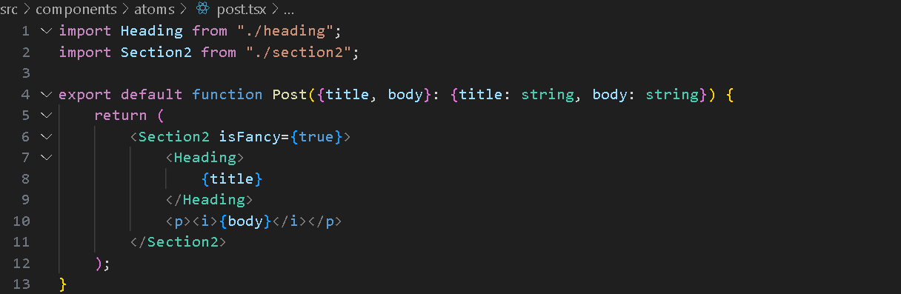
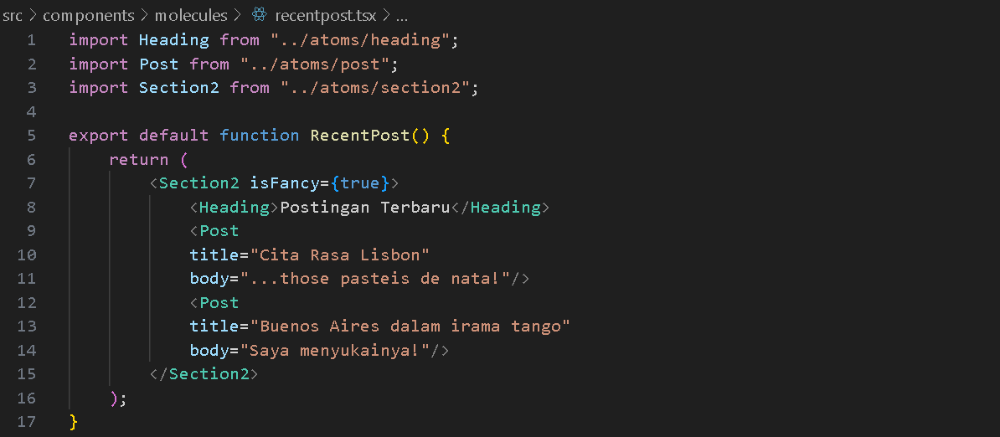
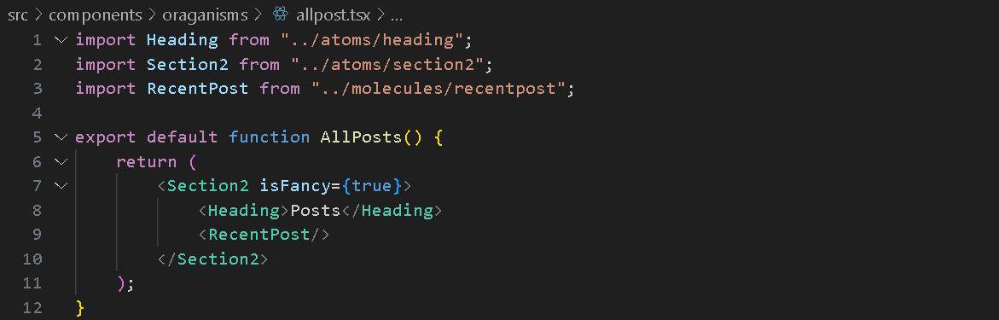
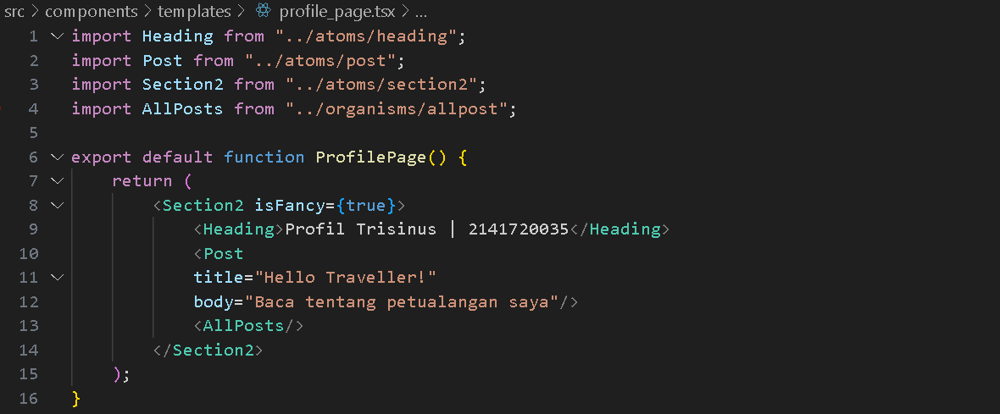

Langkah 2: Tambahkan ProfilePage ke page.tsx lalu run
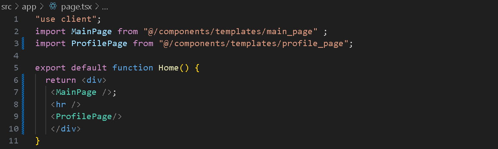
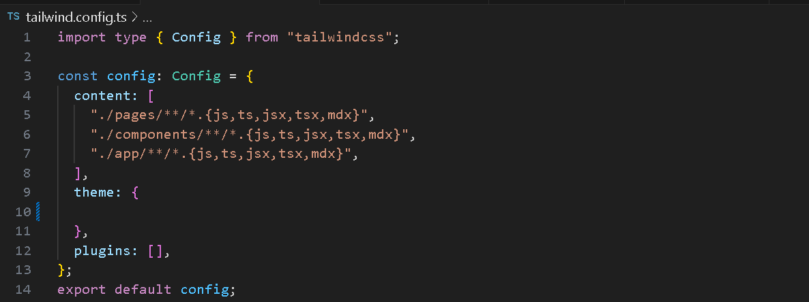
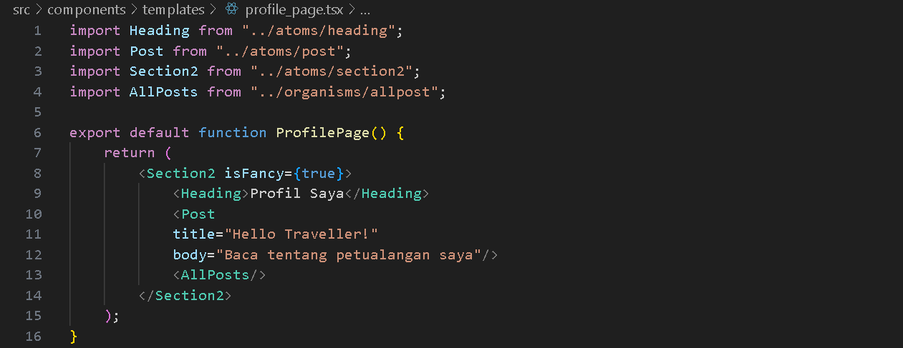
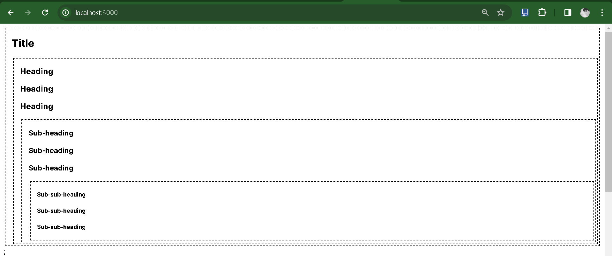
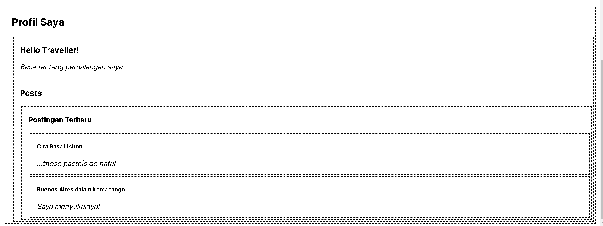


