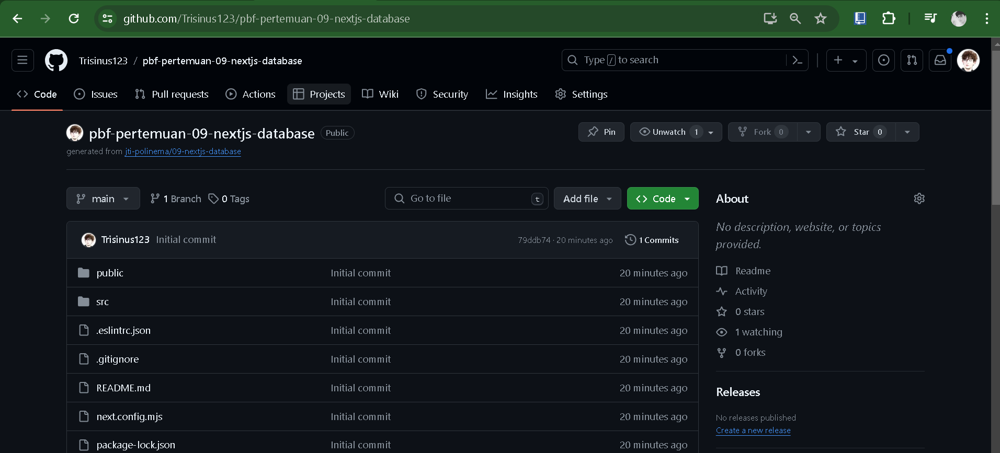
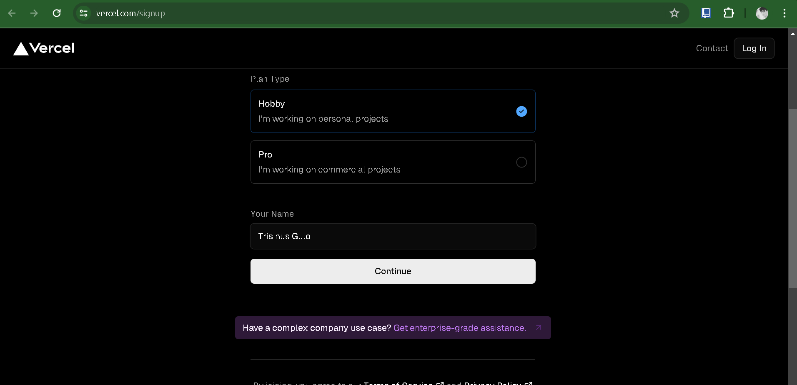
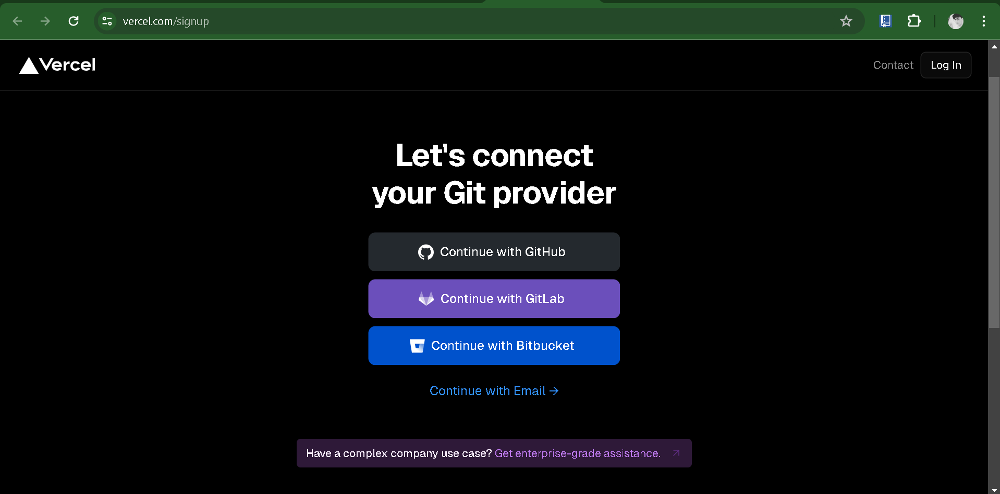
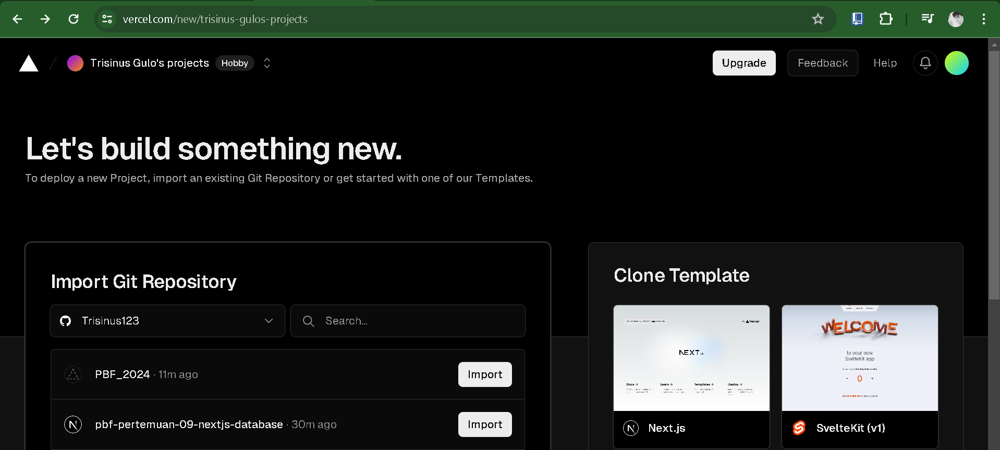
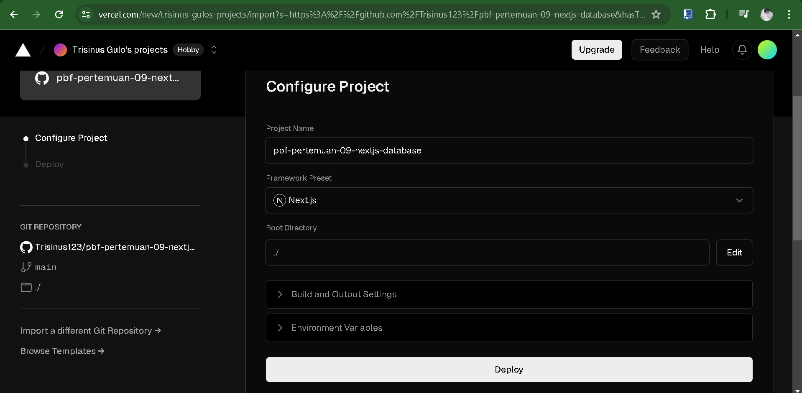
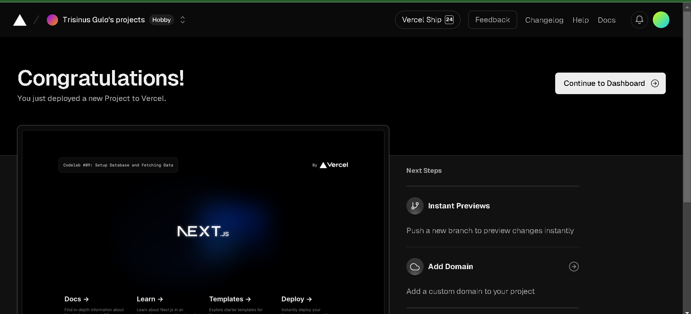

Trisinus Gulo | 2141720035

Praktikum 1 : Setup Database

Langkah 1 : Membuat project baru dengan templat

Langkah 2 : Membuat Akun Vercel

- Klik Contunue With GitHub

Langkah 3 : Koneksikan dan Deploy Project Anda

- Klik Install -> Pilih Repo -> Install

- Klik Import -> Pilih Framework ->Deploy

