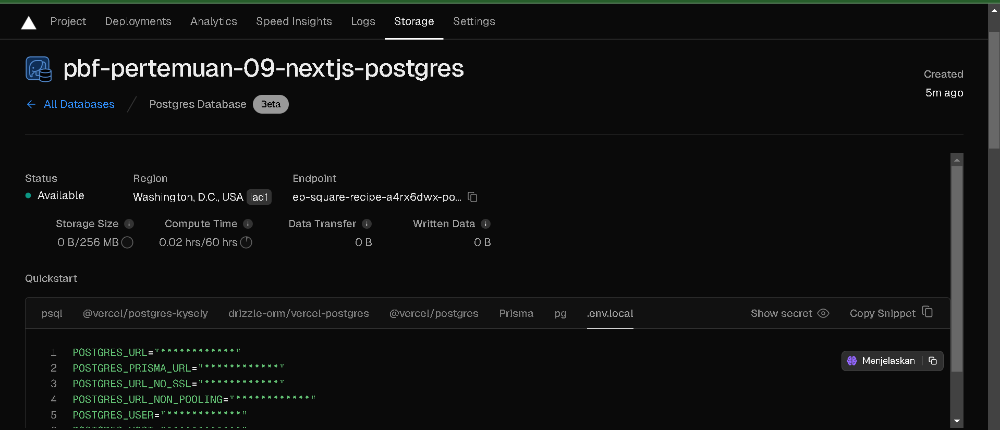

Trisinus Gulo | 2141720035

Praktikum 1 : Setup Database

Langkah 1 : Membuat project baru dengan templat


Langkah 2 : Membuat Akun Vercel


- Klik Contunue With GitHub


Langkah 3 : Koneksikan dan Deploy Project Anda

- Klik Install -> Pilih Repo -> Install


- Klik Import -> Pilih Framework ->Deploy


Soal 1 

Capture hasil deploy project Anda dan buatlah laporan di file README.md. Jelaskan apa yang telah Anda pelajari?

jawab:
dengan menggunakan varcel kita bisa dapat mendeploy project kita pada repository yang kita miliki baik secara keseluruhan maupun hanya yang ingin kita pilih. Selain itu, Vercel juga menyediakan fitur pratinjau untuk melihat laman yang sudah Anda buat sebelum dideploy secara resmi.

Langkah 4 : Membuat basis data Postgres


- Show secret > Copy Snippet




-  install Vercel Postgres SDK.
```bash
npm i --save @vercel/postgres
```

Soal 2

Capture hasil basis data Anda dan buatlah laporan di file README.md. Jelaskan apa yang telah Anda pelajari?

jawab:
Selain digunakan untuk deploy proyek dari GitHub, Vercel juga dapat membantu dalam pembuatan database. Pada praktikum ini, kita menggunakan Vercel untuk membuat database Postgres. Untuk mengakses database tersebut, perlu dibuat file .env dan dimasukkan ke dalam .gitignore agar informasi akses database tidak terbuka di GitHub.

Langkah 5 : Melakukan seed ke basis data


-  Mengeksekusi file seed.js
```bash 
npm run seed
```
Error: Cannot find module 'dotenv/config'
```bash
npm i --save dotenv
```

Error: Cannot find module 'data.js'

\

Error: Cannot find module 'bcrypt'
```bash
npm i --save bcrypt
```


Soal 3

Capture hasil npm run seed Anda dan buatlah laporan di file README.md. Jelaskan apa yang telah Anda pelajari ?

jawab:
File seed.js berfungsi untuk memasukkan data dan tabel ke dalam database, sementara data.js berfungsi untuk menentukan jenis data yang akan dimasukkan ke setiap tabel.

Langkah 6 : Menjelajah Basis Data


Soal 4

Capture hasil query Anda dan buatlah laporan di file README.md. Jelaskan apa yang telah Anda pelajari ? Cobalah eksekusi query SQL yang lain sesuai kreasi Anda, capture hasilnya dan jelaskan!

jawab:
Query di atas menggabungkan tabel invoices dan customers, menampilkan hanya data amount dan name dari masing-masing tabel dengan menghubungkannya melalui customer_id. Data yang ditampilkan hanya amount dari invoices yang memiliki nilai 666.


Praktikum 2 : Fetching Data (API)

Langkah 1 : Membuat Global Query (Model)


- Buat 2 file di dalam folder model yaitu definitions.tsx dan query.tsx


-  Buat file utils.tsx di dalam folder utils


Langkah 2 : Membuat Komponen Atom


- Buat komponen molecules, ada 3 file yaitu card.tsx, latest-invoices.tsx, dan revenue-chart.tsx


- Ganti semua kode di src/app/page.tsx


Soal 5

Lakukan push, kemudian perhatikan di akun dashboard Vercel project Anda. Capture dan lampirkan link aplikasi Anda yang telah berhasil di deploy, kemudian buatlah laporan di file README.md. Jelaskan apa yang telah Anda pelajari ?


[Link App](https://pbf-pertemuan-09-nextjs-database.vercel.app/)

Tentu, mari kita variasikan:

Pertama-tama, kita akan mulai dengan menetapkan struktur data untuk setiap entitas dalam database dengan merancang model definitions. Setelah itu, langkah selanjutnya adalah mengembangkan model query yang memungkinkan akses data dari database menggunakan berbagai query yang sesuai. Selain itu, model query juga memberikan kesempatan untuk mengolah data sebelum disajikan kepada pengguna melalui laman atau client.

Setelah tahap tersebut selesai, fokus akan dialihkan ke pengembangan komponen-komponen dan laman-laman yang akan ditampilkan kepada pengguna. Meskipun laman untuk menampilkan data belum aktif, langkah ini diperlukan untuk memastikan keselamatan program tanpa adanya kesalahan. Seiring dengan kemajuan pengembangan komponen-komponen, langkah berikutnya adalah memperbarui halaman utama (page.tsx) agar komponen-komponen yang telah dibuat dapat diimpor dan ditampilkan saat server berjalan.

**Fetching Data untuk komponen RevenueChart**

-  Menghapus comment pada komponen RevenueChart


Soal 6

Lakukan capture dan push hasilnya, kemudian buatlah laporan di file README.md. Jelaskan apa yang telah Anda pelajari ?

jawab: 
Data Data revenueFetch yang diperoleh akan di olah dan di tampilkan pada laman reactjs, di mulai dari sumbu x dan y saat kita mengeksrack data dan untuk memperoleh 12 data bulan sekaligus bisa melakukan input manual dengan arbitrary value grid-cols-[25px_25px_25px_25px_25px_25px_25px_25px_25px_25px_25px_25px_25px]. tampilannya akan seperti diatas.

**Fetching Data untuk komponen LatestInvoices**


Soal 7
Lakukan capture dan push hasilnya, kemudian buatlah laporan di file README.md. Jelaskan apa yang telah Anda pelajari ?
jawab :
Dengan menggunakan model kueri untuk mengambil 5 data terbaru di dalam fungsi `fetchLatestInvoices`, untuk membatasi hasilnya dengan menambahkan klausa `LIMIT 5` pada kueri data. Data ini kemudian disimpan dalam variabel `latestInvoices` dan diekstrak ke dalam sebuah peta (map), yang kemudian ditampilkan di laman. Hal ini memungkinkan kita untuk menampilkan hanya data terbaru yang paling relevan untuk pengguna.

**Tugas Praktikum**

 1. Jika Anda perhatikan pada file src\app\page.tsx untuk komponen Card sebenarnya telah dibuat sebagai molecules pada file src\app\components\molecules\card.tsx yaitu komponen CardWrapper. Silakan Anda sesuaikan sehingga dapat tampil seperti gambar berikut.

 

 

 2. Perhatikan fungsi fetchCardData() (pada file src\model\query.tsx) dari soal nomor 1. Jelaskan maksud kode dan kueri yang dilakukan dalam fungsi tersebut

 jawab :
 Fungsi `fetchCardData()` bertujuan untuk mengambil data yang diperlukan untuk menampilkan informasi pada kartu di dashboard. Ini mencakup jumlah total invoice yang sudah dibayarkan, jumlah total invoice yang masih tertunda, jumlah total pelanggan, dan total pendapatan yang sudah dibayarkan.  intinya, fungsi ini melakukan beberapa kueri SQL untuk mengambil data yang sesuai, memformat data yang diperlukan, dan mengembalikan objek yang berisi informasi yang akan ditampilkan pada kartu di dashboard.


