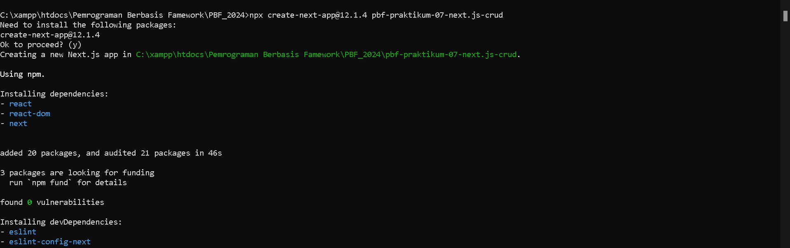
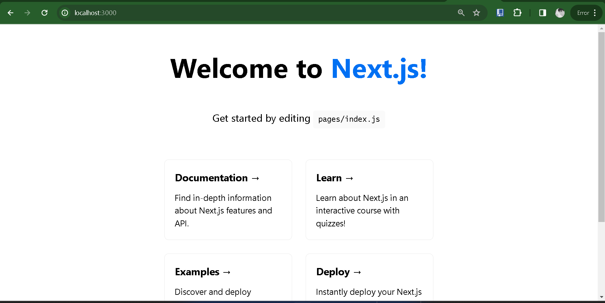
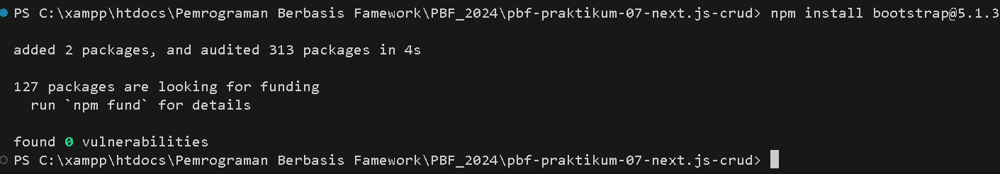
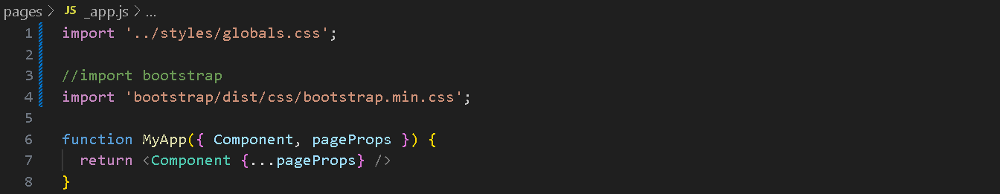
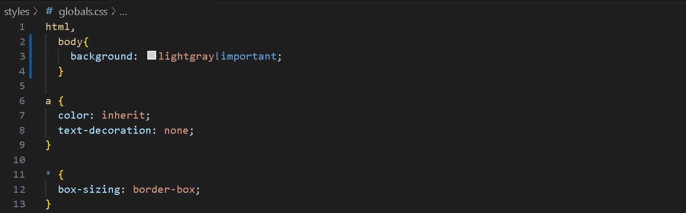
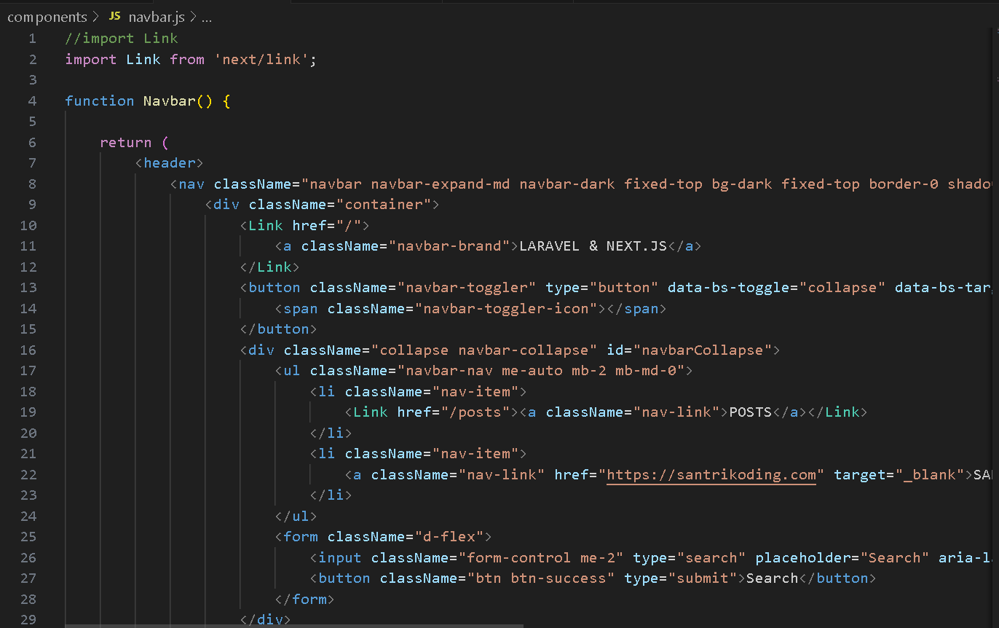
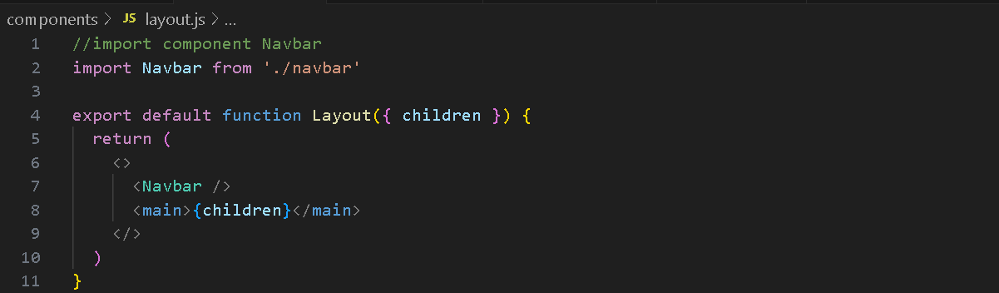

Trisinus Gulo | 2141720035

Praktkum 1 : Membuat Project Baru di Next.js

Langkah 1 : Membuat Project baru


Langkah 2 : Menjalankan project next.js


Praktikum 2 : Install Bootsrap dan Membuat Layout di Next.js

Langkah 1 : Instal Bootsrap
  
Langkah 1 : Instal Bootsrap
```bash
npm install bootstrap
```


Laangkah 2 : KOnfigurasi bootsrap di nextjs 



Langkah 3 : Membuat Component navbar


Langkah 4 : Membuat Layout



