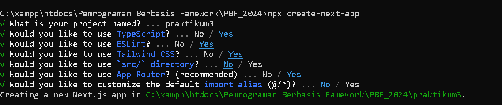
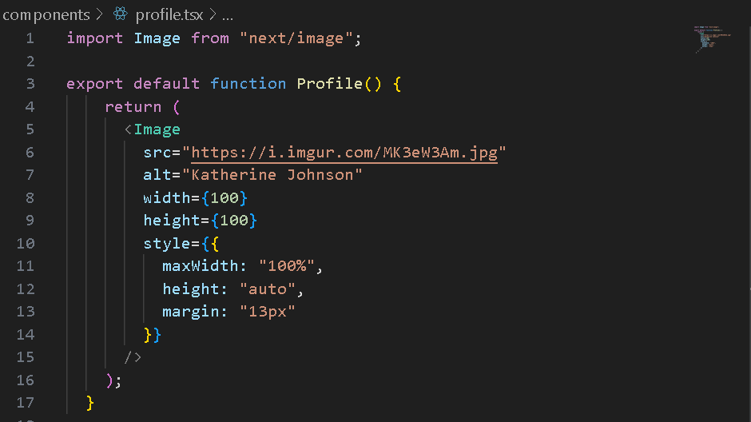
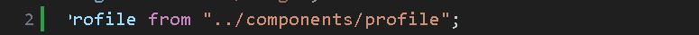
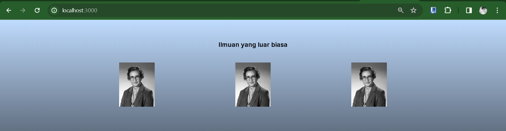
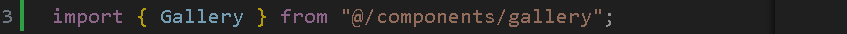
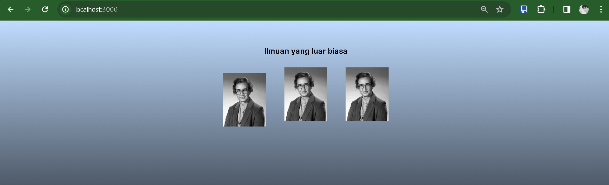
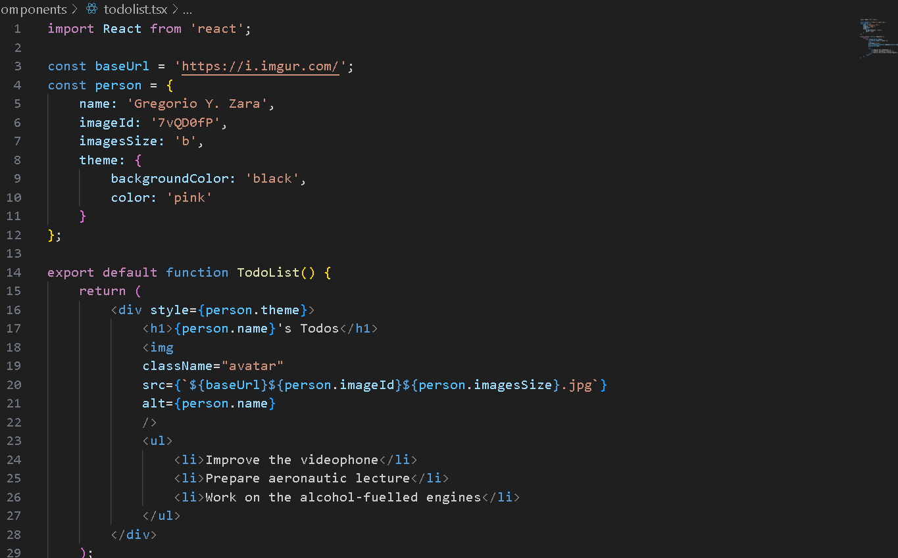
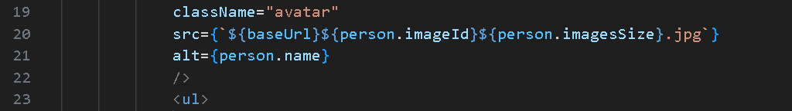
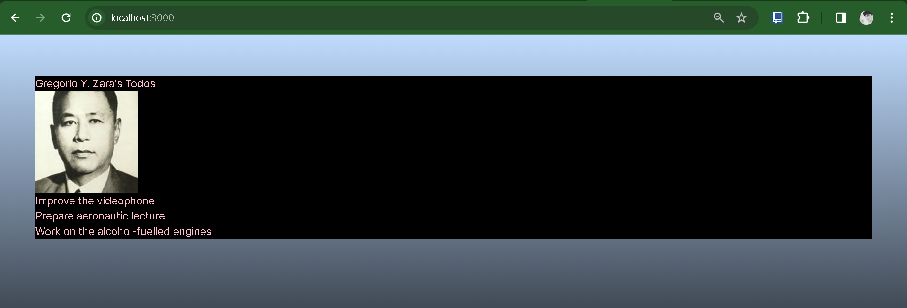

NAMA : Trisinus Gulo

Kelas : TI-3C

Absen : 14

Praktikum 3 : PBF

# Paktikum 1 - Mendefinisikan Komponen

Langkah 1 : Membuat Folder Baru

Langkah 2: Buat Komponen Baru

Membuat folder baru dan file baru di src/components/profile.tsx

Langkah 3: Import Komponen

import komponen Profile ke src/app/page.tsx

**Soal 1**

Ubah isi kode Home() sehingga dapat tampil seperti berikut dengan memanfaatkan komponen Profile() yang tadi sudah dibuat dari langkah 1 tersebut!

Hasil Output

Penjelasan:

## Praktikum 2 - Mengimpor dan Mengekspor Komponen

Langkah 1 - Membuat Komponen Baru

membbuat file baru di src/components/gallery.tsx

Langkah 3 - Import Komponen

**Soal 2**

Hasil Output

Penjelasan:

# Aturan JSX

# Praktikum 3 - Menggunakan JSX dinamis

Soal 4

Kode yang Awal menngalami error di karenakan reach setelah di perbaharui akan tampil seperti ini dan tidak mengalami error lagi 

Soal 5

Soal 6  :

Hasilnya tetap sama cuma ada di yang tambahkan huruf dolar $ di dalam commponets file todolist

Hasil Output

# Praktikum 4: Menggunakan Props

Langkah 1 - Membuat Komponen Baru src/components/mygallery.tsx 

