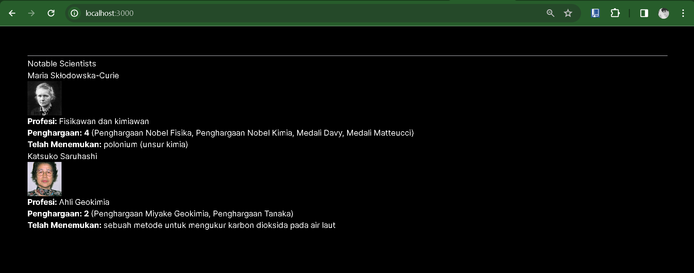
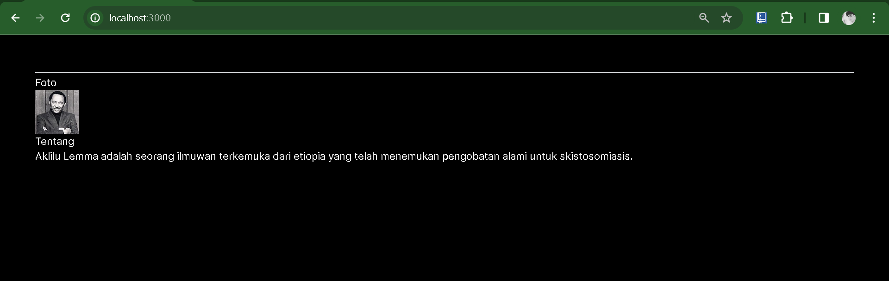

NAMA : Trisinus Gulo

Kelas : TI-3C

Absen : 14

Praktikum 3 : PBF

# Paktikum 1 - Mendefinisikan Komponen

Langkah 1 : Membuat Folder Baru

Langkah 2: Buat Komponen Baru

Membuat folder baru dan file baru di src/components/profile.tsx

Langkah 3: Import Komponen

import komponen Profile ke src/app/page.tsx

**Soal 1**

Ubah isi kode Home() sehingga dapat tampil seperti berikut dengan memanfaatkan komponen Profile() yang tadi sudah dibuat dari langkah 1 tersebut!

Hasil Output

Penjelasan:

## Praktikum 2 - Mengimpor dan Mengekspor Komponen

Langkah 1 - Membuat Komponen Baru

membbuat file baru di src/components/gallery.tsx

Langkah 3 - Import Komponen

Penjelasan:
Terdapat kesalahan saat memuat gambar dari URL yang diperlukan untuk diperbaiki. Solusinya adalah dengan menambahkan domain gambar yang digunakan ke dalam berkas next.config.mjs. 

**Soal 2**

Hasil Output

Penjelasan:
Setelah memperbarui kode, perbedaan dalam tata letak gambar mungkin terjadi karena kelas CSS yang digunakan. Dalam contoh Anda, kelas yang digunakan adalah columns-3. Jika tata letaknya tampak berbeda, mungkin perlu menyesuaikan gaya CSS untuk kelas tersebut. Anda dapat menyesuaikan properti-properti CSS yang sesuai dengan kebutuhan tata letak gambar Anda.

Terkait dengan penggunaan nama fungsi, dalam JavaScript, untuk fungsi default
# Aturan JSX

# Praktikum 3 - Menggunakan JSX dinamis

Soal 4

Kode yang Awal menngalami error di karenakan reach setelah di perbaharui akan tampil seperti ini dan tidak mengalami error lagi 

Soal 5

Penjelasan :

Meskipun hasil yang ditampilkan masih mirip dengan sebelumnya, hal itu disebabkan oleh penambahan atribut pada objek person dan penggunaannya kembali seperti atribut lain seperti theme dan name. Meskipun demikian, penambahan atribut pada objek person memberikan fleksibilitas tambahan dalam representasi data dan dapat digunakan dalam logika aplikasi atau tampilan. Dengan cara ini, meskipun hasilnya serupa, ada peningkatan dalam fleksibilitas dan kemampuan untuk memanipulasi data secara lebih kaya.

Soal 6  :

Hasilnya tetap sama cuma ada di yang tambahkan huruf dolar $ di dalam commponets file todolist

Hasil Output

# Praktikum 4: Menggunakan Props

Soal 7

Hasil Output

Penjelasan :
Terdapat error pada penggunaan getImageUrls pada @/utils/utils dikarenakan fungsi tersebut akan dibuat pada langkah berikutnya.Dari penggunaan props tersebut, suatu function dapat memiliki suatu parameter yang nantinya dapat memperoleh value dari parent, parameter tersebut dapat juga diberi nilai default jika value tidak diberikan nilai ataupun undifined.

Soal 8

Penjelasan:

Sebelumnya, terdapat masalah dengan URL gambar yang mengakibatkan gambar tidak dapat dimuat dengan benar. Namun, setelah memperbarui parameter-parameter seperti yang telah disebutkan sebelumnya, URL yang diberikan sekarang dapat memberikan hasil yang tepat. Sebagai hasilnya, tampilannya sekarang sesuai dengan yang ditunjukkan di bawah ini. Dengan perubahan ini, gambar sekarang dimuat dengan benar, menghadirkan pengalaman visual yang sesuai dengan harapan.

Soal 9

Penjelasan:
Dengan pembuatan fungsi Card, kita dapat menulis tag yang berulang seperti card hanya sekali dalam fungsi tersebut. Kemudian, dengan menggunakan fungsi tersebut, komponen yang sama dapat digunakan di berbagai tempat dengan penulisan yang lebih singkat dan efisien. Ini memungkinkan untuk meningkatkan kejelasan dan konsistensi dalam kode, sambil mengurangi pengulangan yang tidak perlu.