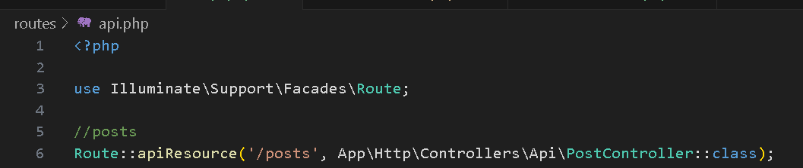
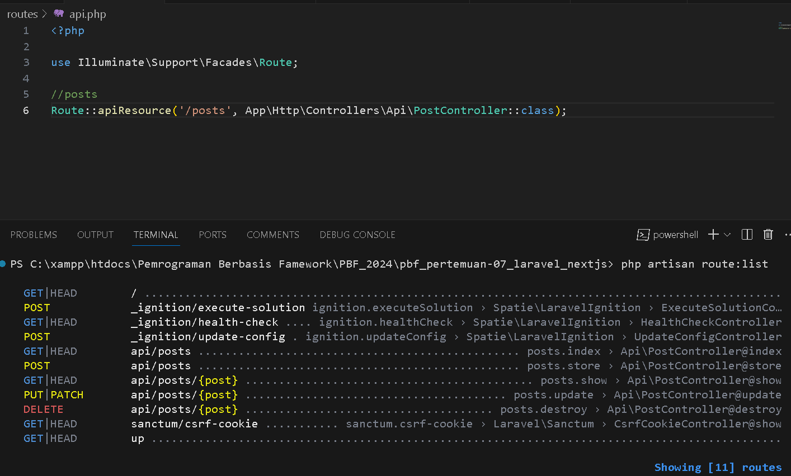
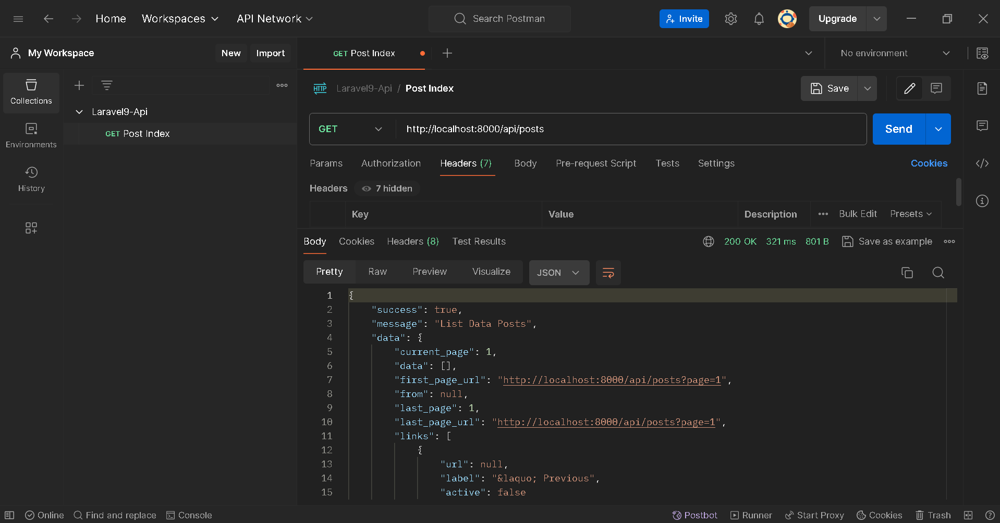

Nama : Trisinus Gulo

Absen : 14

Kelas : TI-3C

Praktikum 1 - Install Laravel 9

Langkah 1 - Membuat project baru


Langkah 2 - Menjalankan project


Langkah 3 - Konfigurasi Koneksi ke database


Langkah 4 - Membuat DataBase


Langkah 5 - Membuat model dan migration


Langkah 6 - Menjalankan migration


Langkah 7 - Menambah Mass Assigment


Langkah 8 - Menjalankan Storage Link
```bash
php artisan storage:link
```


Praktikum 2 - Membuat Api Resource

Langkah 1 - Membuat api resource

```bash 
php artisan make:resource PostResource
```


Langkah 2 - Melakukan customer Api Resource


Praktikum 3 - Menampilkan Data dari Database

Langkah 1 - Membuat Controller
```bash
php artisan make:controller Api/PostController
```


Langkah 2 - Membuat Route Api Resource
```bash
php artisan install:api
```


Langkah 3 - Uji Coba Rest Api

