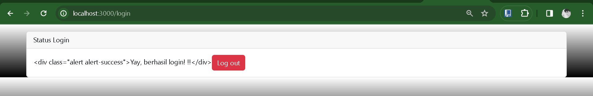
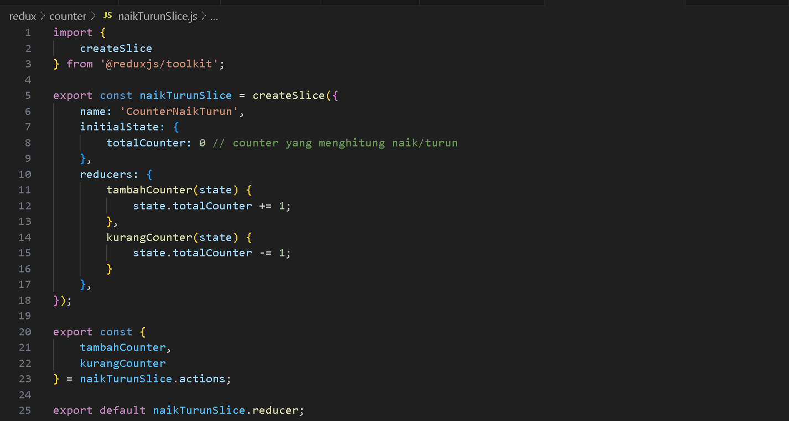
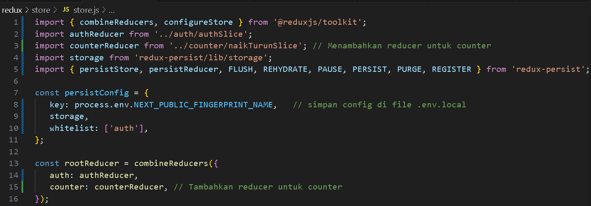
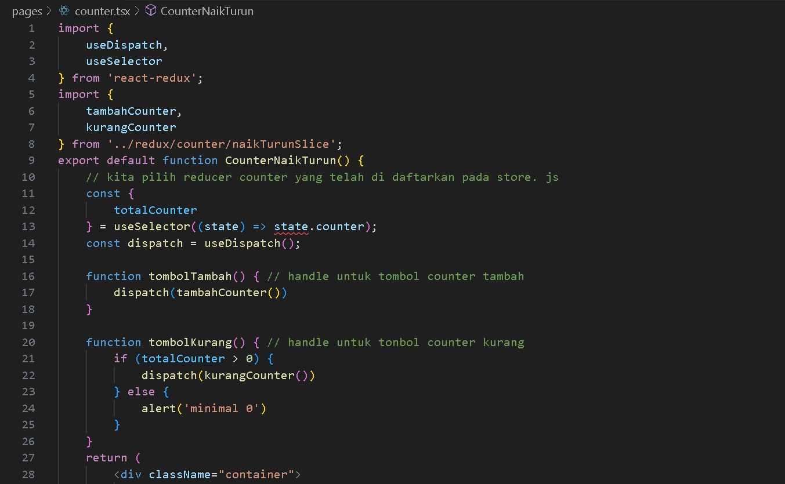
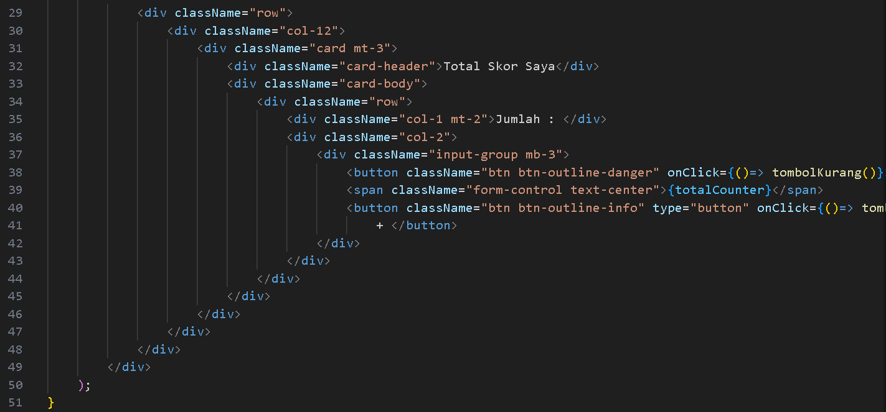
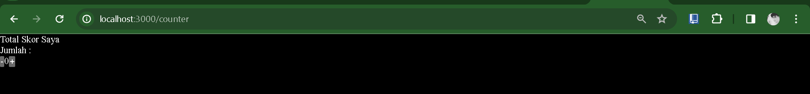

Nama : Trisinus Gulo

Kelas : TI-3C

Nim : 2141720035

Praktikum 1 - Instalasi Redux dan bootstrap

Praktikum 2 - Contoh Login dengan Redux

Langkah 1- mengecek  file package.json

Langkah 2 - Membaut redux/auth/authSlice.js

Langkah 3 - membuat file .env.local

Langkah 4 - Membuat file redux/store/store.js

Langkah 5 - buat file baru di pages/login.tsx

Terjadi saat mengakses /login, sehingga perlu memberbarui file _app.tsx

Soal
1. Coba akses http://localhost:3000/login, dan klik tombol login. Kemudian lakukan refresh page berkali-kali (jika perlu restart npm run dev nya). Simpulkan apa yang terjadi ?

terjadi error saat melakukan restart di halaman webnya tersebut.

2. Baris 25 dan 30 terdapat method parse(), apa yang terjadi jika kita tidak menggunakan method tersebut? 

Tanpa menggunakan method `parse()`, string HTML akan dianggap sebagai teks biasa dan tidak akan diinterpretasikan sebagai elemen HTML yang sebenarnya di dalam JSX. Dengan menggunakan `parse()`, string HTML diuraikan menjadi elemen HTML sesuai dengan strukturnya sehingga dapat dirender dengan benar di dalam JSX.

Praktikum 3 - Membuat Aplikasi Counter Sederhana

Langkah 1 -  Membuat file di redux/counter/naikTurunSlice.js

Langkah 2 - Memodifikasi redux/store/store.js

Langkah 3 - Membuat file baru di pages/counter.tsx

Hasil Output

**Tugas (Pertanyaan Praktikum)**

  Berdasarkan pada praktikum sebelumnya yang telah dilakukan, beberapa pertanyaan terkait praktikum perlu diselesaikan yaitu sebagai berikut.

1. Apa kegunaan dari kode ini import { useEffect } from "react"; Pada file pages/_app.tsx? jelaskan
2. Jika pada file pages/_app.tsx kita tidak menggunakan useEffect (menghapus baris 3, dan baris 9-11, apa yang akan terjadi?
3. Mengapa di react/nextjs penulisan tag html untuk class, harus diganti menjadi className ?
4. Apakah store pada nextjs bisa menyimpan banyak redux reducer?
5. Jelaskan kegunaan dari file store.js!
6. Pada file pages/login.tsx, apa maksud dari kode ini ?
const { isLogin } = useSelector((state) => state.auth);
7. Pada file pages/counter.tsx, apa maksud dari kode ini?
const {totalCounter} = useSelector((state) => state.counter);
Back

Jawaban : 

1. Kegunaan dari `import { useEffect } from "react";` pada file `pages/_app.tsx` adalah untuk mengimpor hook `useEffect` dari pustaka React. `useEffect` digunakan untuk melakukan side effects di dalam komponen React, seperti pengambilan data dari API, manipulasi DOM, dan lain sebagainya. Pada file `_app.tsx`, `useEffect` dapat digunakan untuk mengatur efek global yang berlaku untuk setiap halaman di aplikasi Next.js, misalnya pengaturan layout, pengambilan data global, dan lain-lain.

2. Jika kita tidak menggunakan `useEffect` pada file `pages/_app.tsx` (dengan menghapus baris 3 dan baris 9-11), maka efek yang telah ditetapkan dalam `useEffect` tersebut tidak akan terjadi. Hal ini dapat menyebabkan fungsionalitas yang diatur oleh `useEffect` tidak berjalan, seperti inisialisasi data global, pengaturan layout global, dan lain-lain.

3. Di React/Next.js, penulisan atribut `class` dalam tag HTML harus diganti menjadi `className` karena `class` merupakan kata kunci yang sudah dipesan dalam JavaScript untuk mendefinisikan kelas. Oleh karena itu, untuk menghindari konflik dengan JavaScript, dalam JSX kita menggunakan `className` sebagai pengganti `class` untuk menetapkan kelas CSS pada elemen HTML.

4. Ya, store pada Next.js bisa menyimpan banyak redux reducer. Redux store pada Next.js sama seperti Redux store pada aplikasi React biasa, di mana Anda dapat menggabungkan beberapa reducer menggunakan `combineReducers()` untuk mengelola state aplikasi secara terpusat.

5. File `store.js` berfungsi sebagai pusat pengaturan Redux store untuk aplikasi Next.js. Di dalam file ini, Anda dapat mengonfigurasi middleware Redux, menggabungkan reducer dengan fungsi `combineReducers()`, dan membuat store Redux yang akan digunakan oleh komponen-komponen dalam aplikasi.

6. Pada file `pages/login.tsx`, kode `const { isLogin } = useSelector((state) => state.auth);` digunakan untuk mengekstrak nilai `isLogin` dari state Redux dengan menggunakan selector `useSelector`. Nilai `isLogin` kemudian digunakan dalam komponen untuk menentukan apakah pengguna sudah login atau belum.

7. Pada file `pages/counter.tsx`, kode `const {totalCounter} = useSelector((state) => state.counter);` digunakan untuk mengekstrak nilai `totalCounter` dari state Redux dengan menggunakan selector `useSelector`. Nilai `totalCounter` kemudian digunakan dalam komponen untuk menampilkan jumlah total dari counter yang ada di aplikasi.

