Nama : Trisinus Gulo

Kelas : TI-3C

Nim : 2141720035

Praktikum 1 - Instalasi Redux dan bootstrap

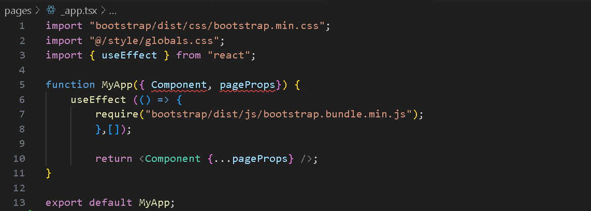
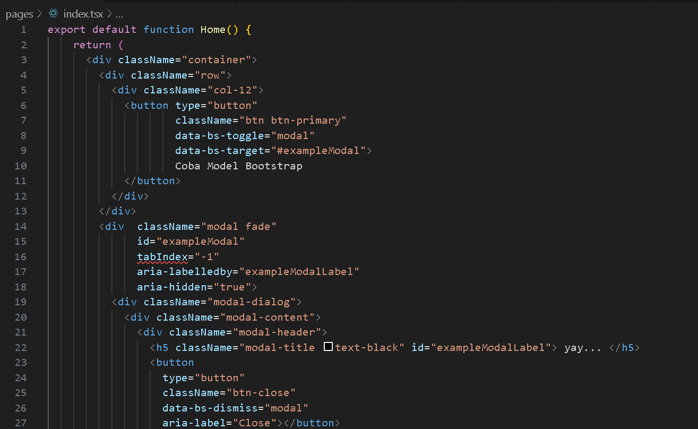
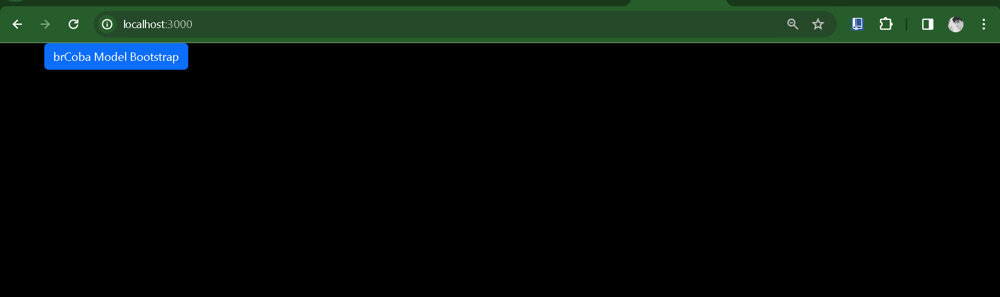
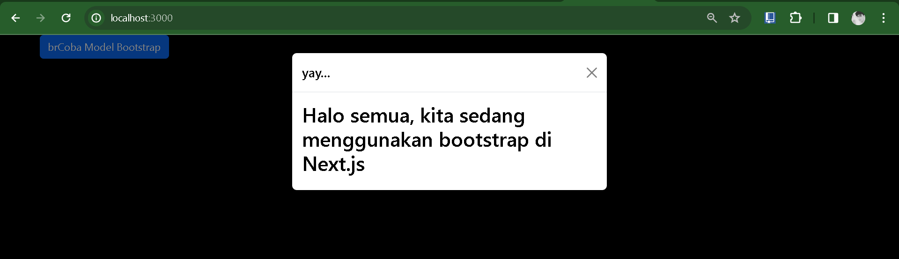

Praktikum 2 - Contoh Login dengan Redux

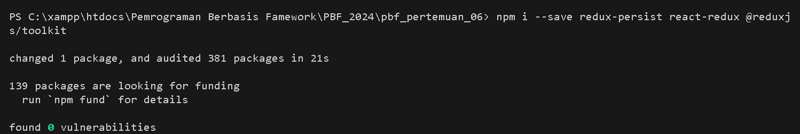
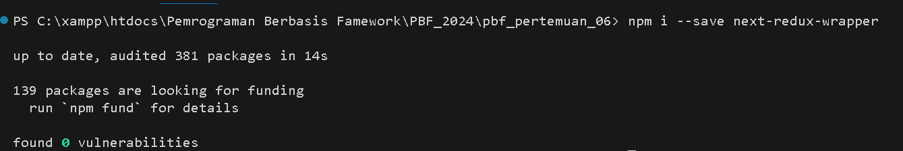
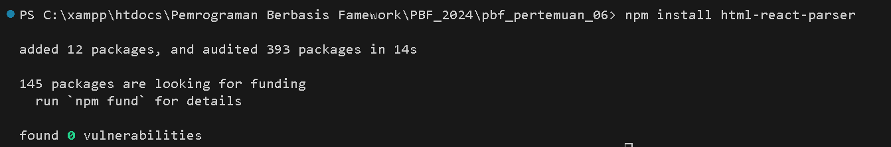

Langkah 1- mengecek  file package.json

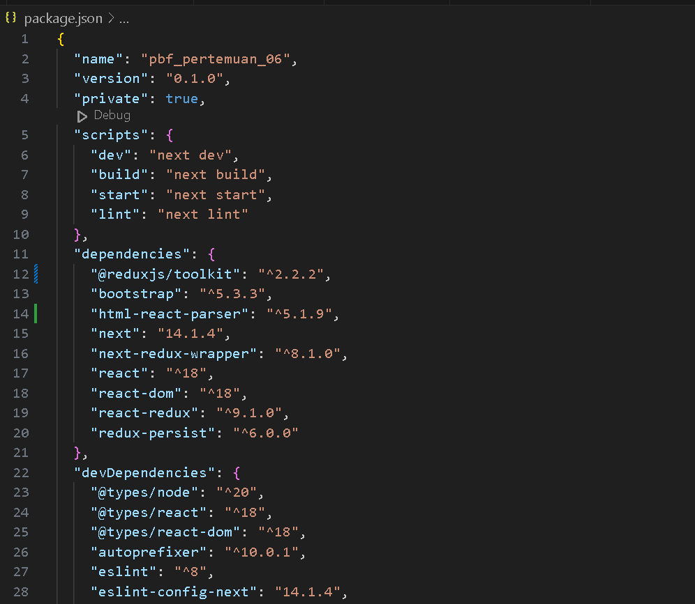

Langkah 2 - Membaut redux/auth/authSlice.js

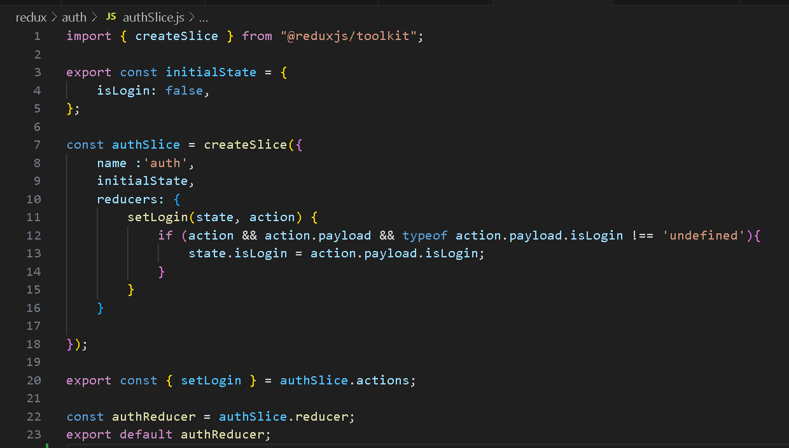

Langkah 3 - membuat file .env.local

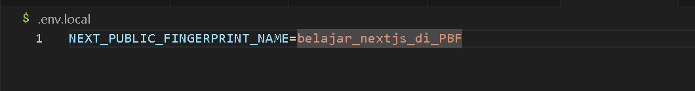

Langkah 4 - Membuat file redux/store/store.js

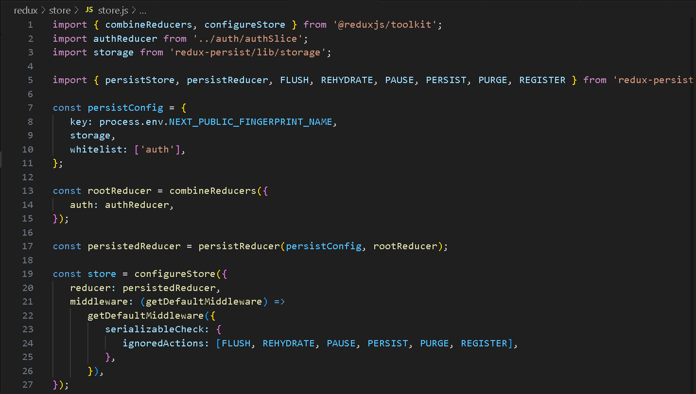

Langkah 5 - buat file baru di pages/login.tsx

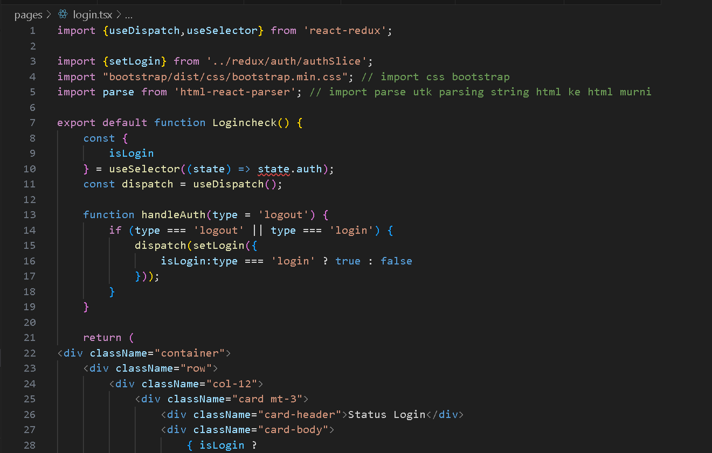

Terjadi saat mengakses /login, sehingga perlu memberbarui file _app.tsx
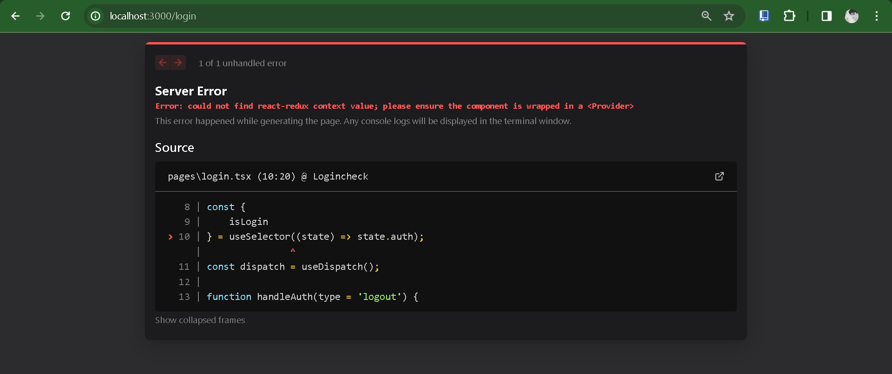
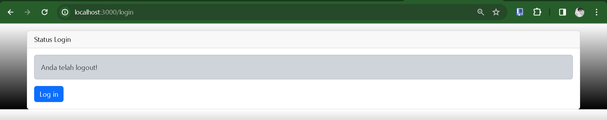
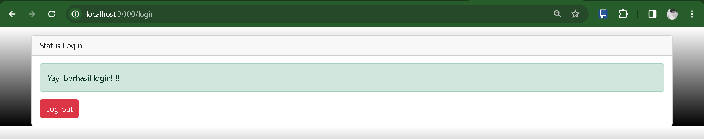

Soal
1. Coba akses http://localhost:3000/login, dan klik tombol login. Kemudian lakukan refresh page berkali-kali (jika perlu restart npm run dev nya). Simpulkan apa yang terjadi ?
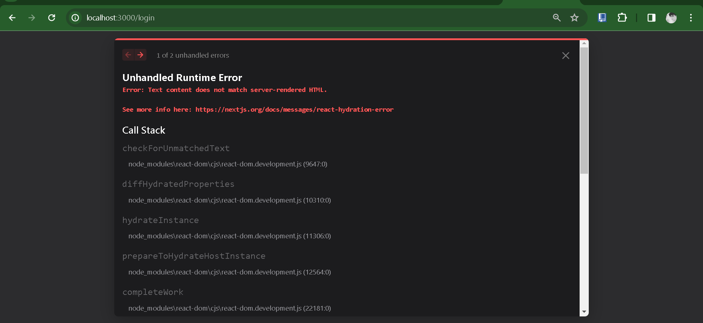
terjadi error saat melakukan restart di halam webnya

<!-- 2. Baris 25 dan 30 terdapat method parse(), apa yang terjadi jika kita tidak menggunakan method tersebut? -->

