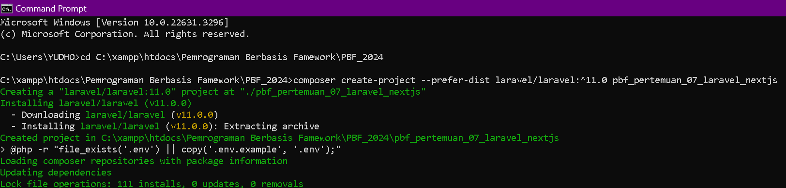
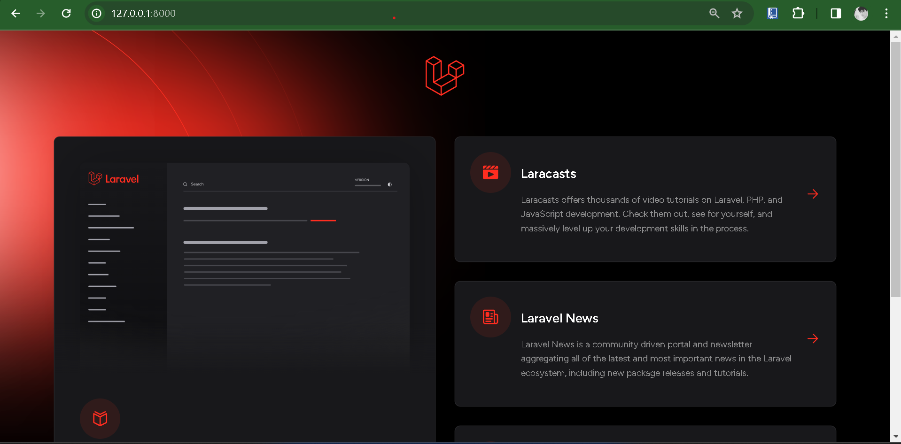
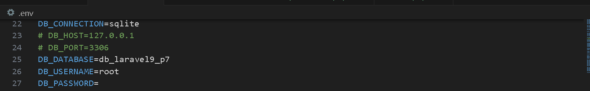
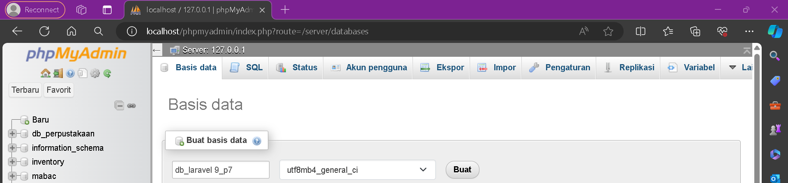
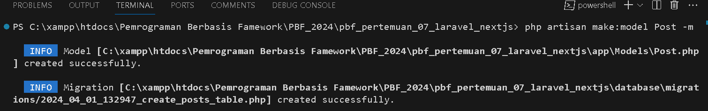
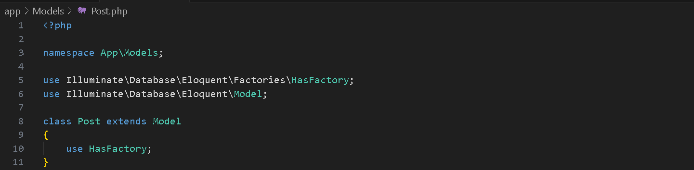
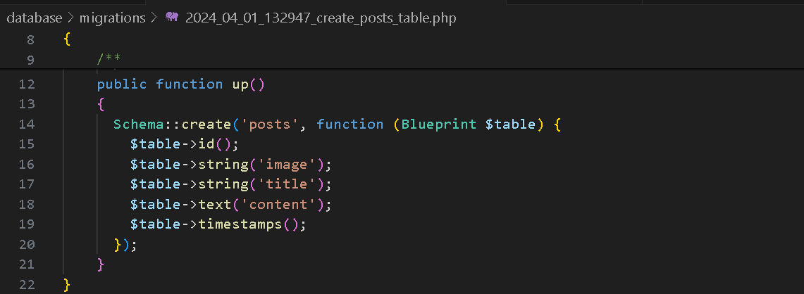
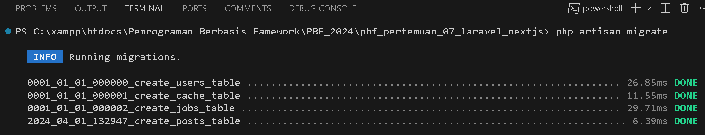

Nama : Trisinus Gulo

Absen : 14

Kelas : TI-3C

Praktikum 1 - Install Laravel 9

Langkah 1 - Membuat project baru

Langkah 2 - Menjalankan project

Langkah 3 - Konfigurasi Koneksi ke database

Langkah 4 - Membuat DataBase

Langkah 5 - Membuat model dan migration

Langkah 6 - Menjalankan migration

