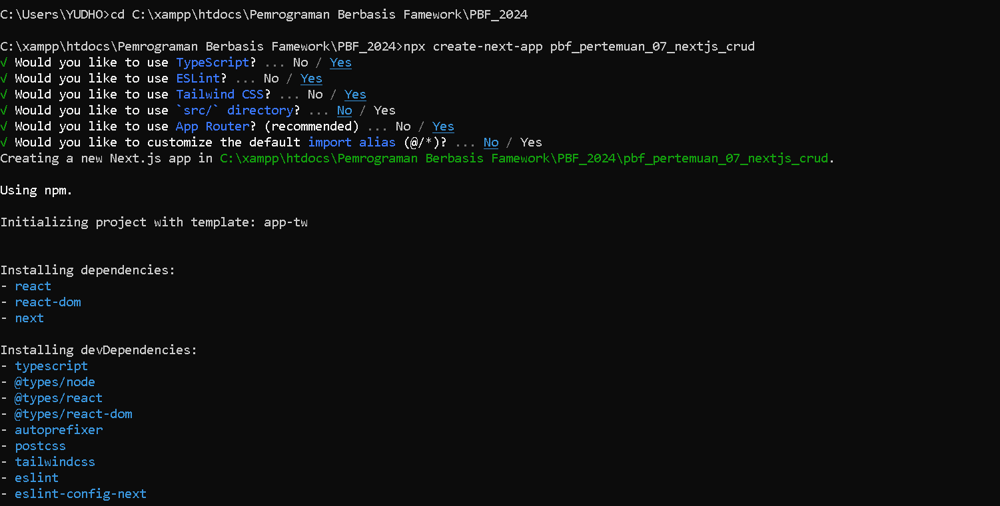
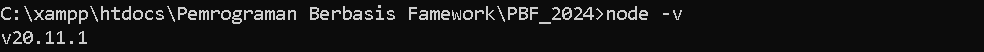
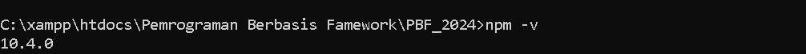
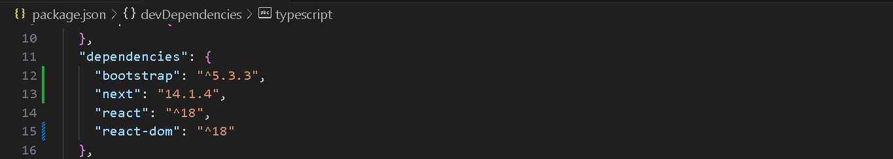
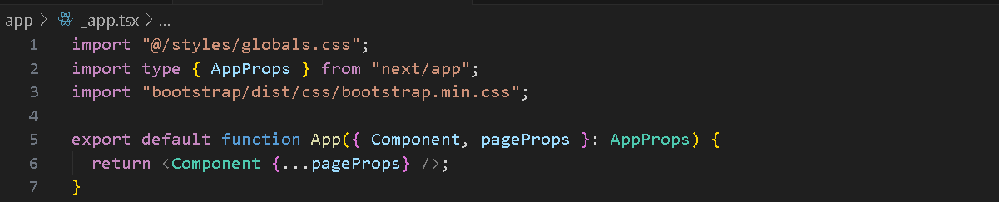
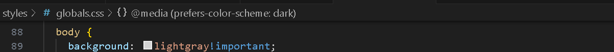
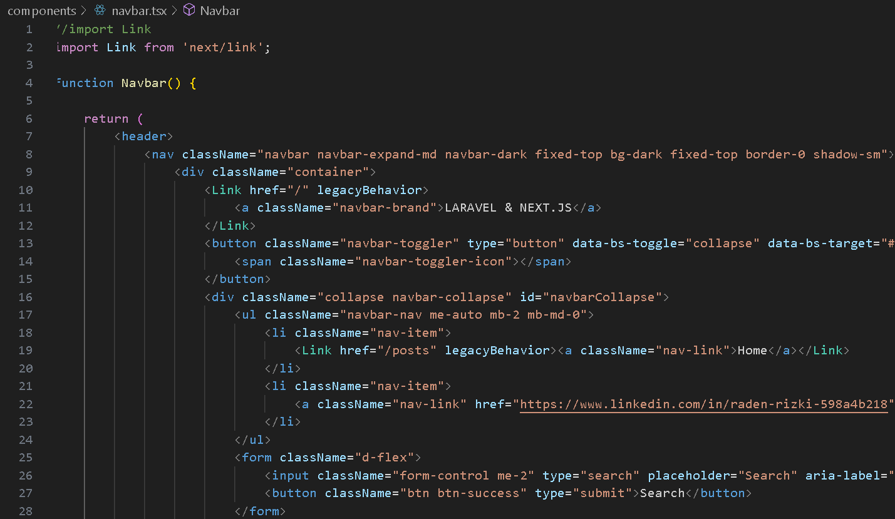
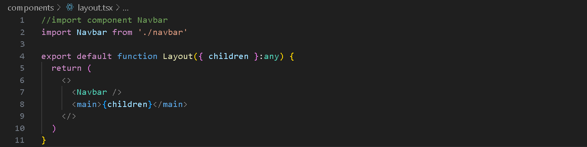

Nama : Trisinus Gulo 

Kelas : TI-3C

Absen : 14

Praktikum 1 : Praktikum 1: Membuat Project Baru di Next.js

Langkah 1 - Membuat Proyek Baru Next.js
```bash
npx create-next-app pbf_pertemuan_07_nextjs_crud
```


```bash
node -v
```


```bash
npm -v
```


Praktikum 2 :  Install Bootsrap dan Membuat Layout di Next.js

Langkah 1 - Instal Bootsrap
```bash
npm install bootstrap
```


Langkah 2 - Konfigurasi Boostrap di Next.js



Langkah 3 - Membuat Komponen Navbar


Langkah 4 - Membuat Layout


<!-- Praktikum 3: Menampilkan Data di Next.js (Server Side)

Langkah 1 - Install Axios
```bash
npm install axios
``` -->


