Nama : Trisinus Gulo

Nim : 2141720035

Absen : 14

Pertemuan 4 : PBF

Praktikum 1 - EVent Hadler

Langkah 1

mencoba membuat tombol sederhana yang belum bisa melakukan apa-apa alias belum bisa  buat event handler untuk tombol tersebut. Sebagai contoh, berikut adalah sebuah tombol yang belum melakukan apa pun. Membuat folder/file baru di src/component/button.tsx
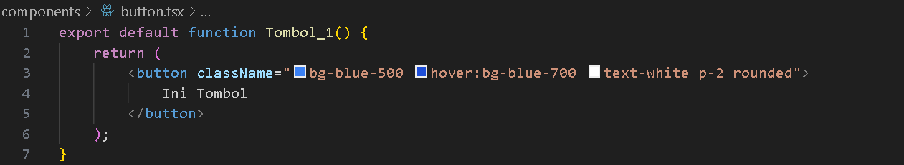

pada file src/app/page.tsx
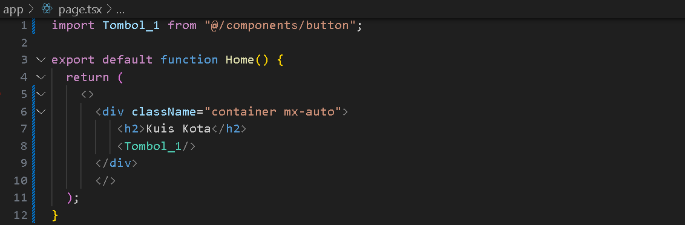

**Hasil Output**

Langkah 2

Menambahkan event pada tombol tersebut. Seperti contoh kita buat ketika tombol di klik, akan memunculkan notif/alert. Kita dapat membuat pesan ketika pengguna mengeklik dengan mengikuti tiga langkah berikut:

1. Deklarasikan sebuah fungsi bernama handleClick di dalam komponen Button kita.
2. Implementasikan logika di dalam fungsi tersebut (gunakan alert untuk menampilkan pesan).
3. Tambahkan handler onClick={handleClick} ke tag JSX < button >

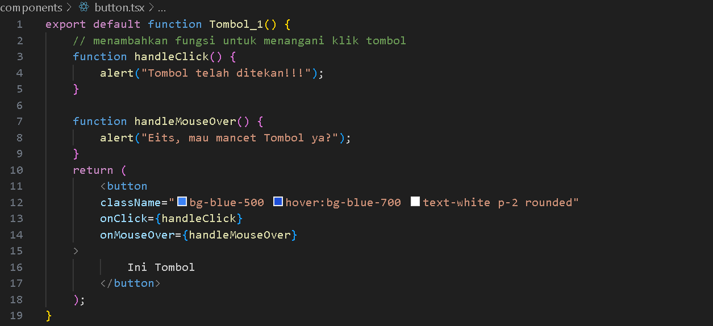
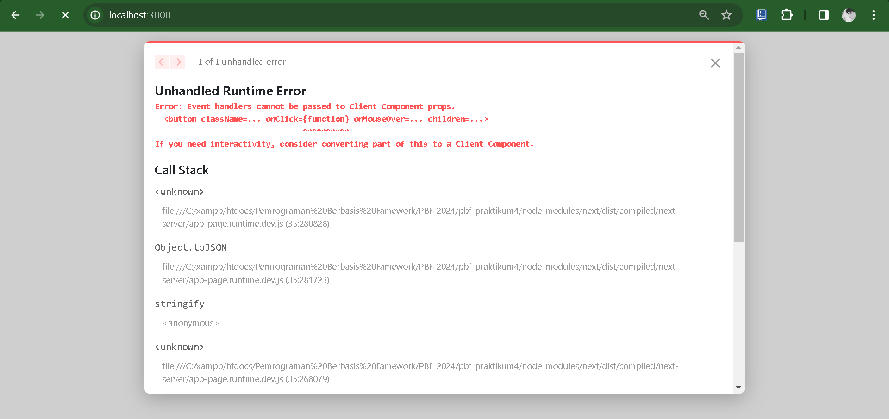
mengalamai error di karenakan belum melakukan pengaturan komponen untuk mengatasi error tersebuat butuh mengatur agar komponen yang di gunakan menjadi komponen client. Untuk menjadikan komponen client,  cukup memberikan perintah ini "use client"; pada baris pertama file page.tsx
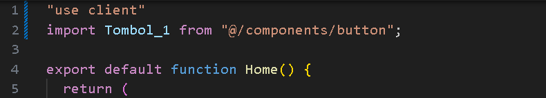
**Hasil Output**

Berhasil di jalankan dan ketika di klink butonnya akan muncul perintah seperti di bawah

Praktikum 2

Membuat fungsi baru di componect/button tsx
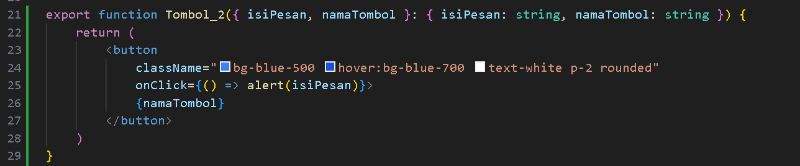
Memodifikasi file page.tsx
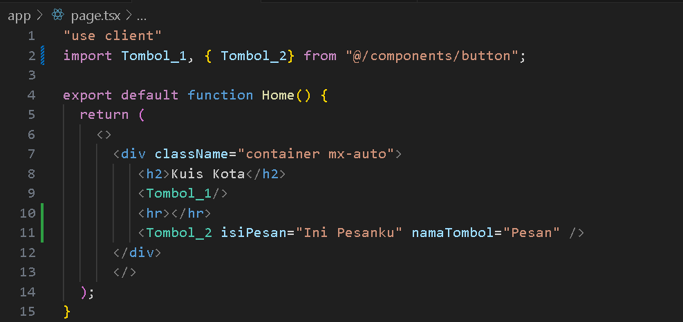

Ketika diklik button pesan
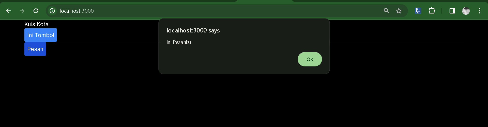
**Penjelasan**
- pada praktikum 2 hasilnya sama di praktikum 1 kita cuma memodifikasi kodingannya aja dengan menambahkan button pesan saja
- Pada Praktikum 2 dimana pada kodingan button.tsx untuk export function buttonya untuk isi pesan dan nama tombolnya akan bergaris merah untuk itu saya menambahkan salah satu tipe data yaitu string seperti di bawah ini

      export function Tombol_2({ isiPesan, namaTombol }: { isiPesan: string, namaTombol: string }){

Praktikum 3

Langkah 1 - Propagation 
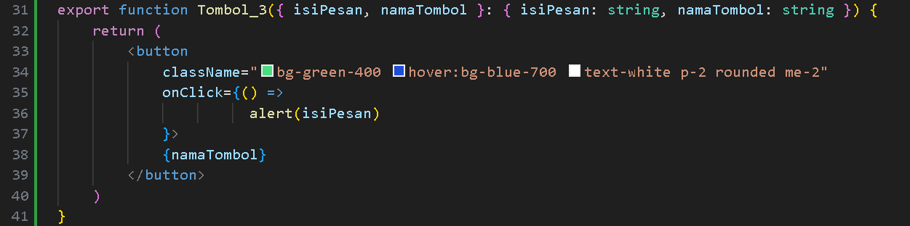

Memodifikasi file page.tsx
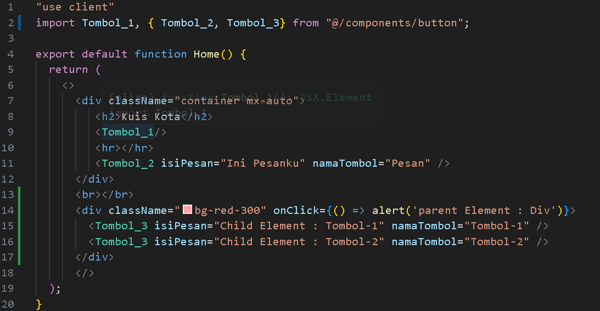
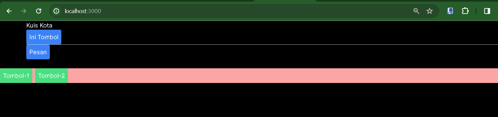
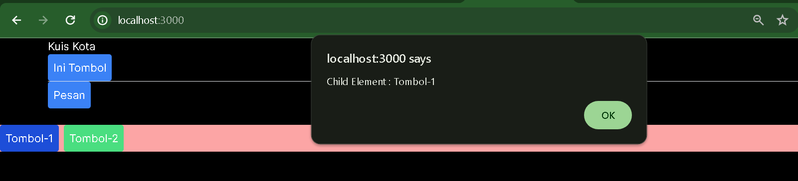
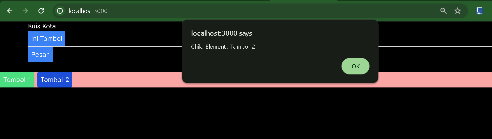

Langkah 3 - Stop Propagation

Praktikum 4

langkah 1
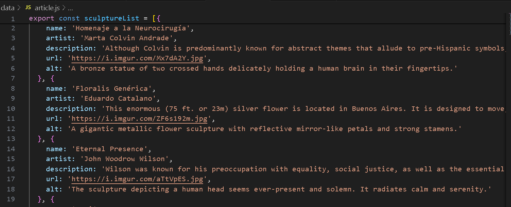
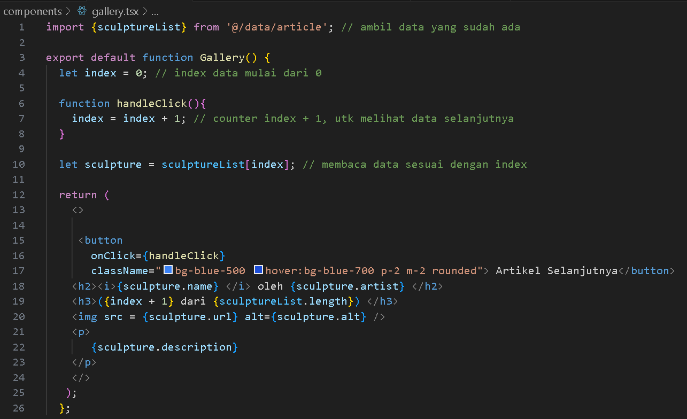
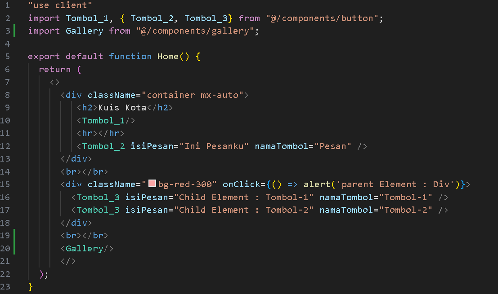
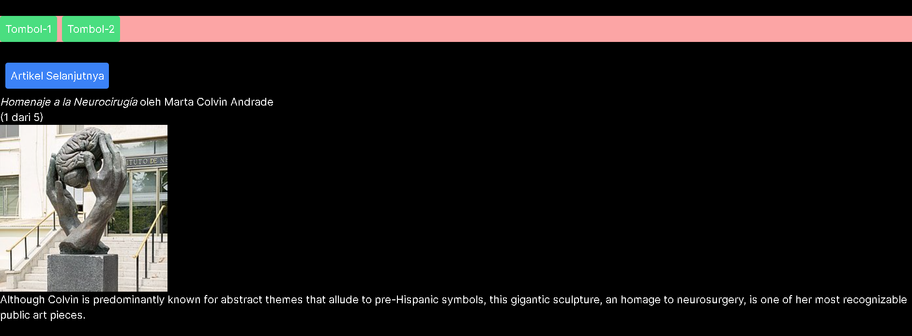
akan menampilkan artikel dan juga gambar arkel tersebut 

Langkah 2
Menambahkan Variabel state

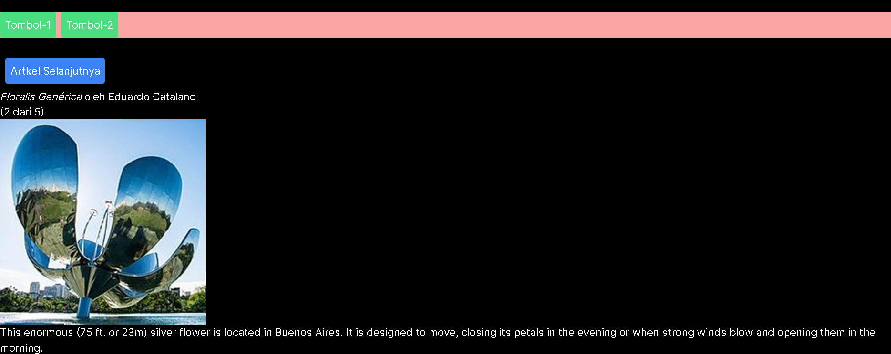
pada langkah ini bisa kita megklik  artikel selanjutnya di karenakan melakukan modifikasi pada kodingannya gallery.tsx

Soal
1. Jika kita menekan tombol "Artikel Selanjutnya" sebanyak 5x (atau melebihi halaman total artikel), apa yang akan terjadi?

dengan menekan tombol artkel tersebut sebanyak 5 kali akan mengalami error karena melebih index dari artkel tersebut sehingga tidak bisa kita next ke 5 kalinya.
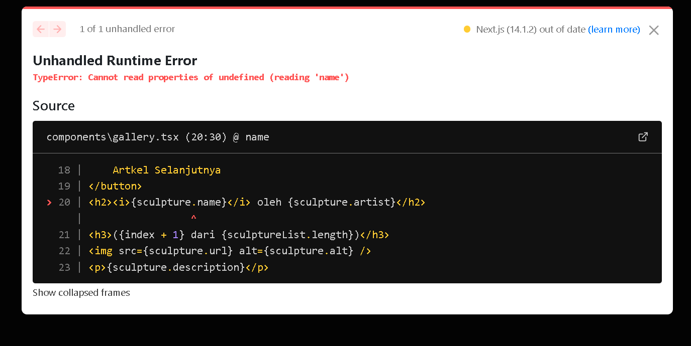
2. Modifikasilah gallery.tsx agar bisa meng-handle permasalahan tersebut.
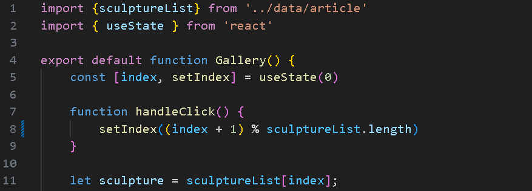
melakukan midifikasi dengan menambahkan Modulus increment dari index sehingga dihasilkan dari 0 sampe index terakhir

3. Tambahkan tombol "Artikel Sebelumnya", untuk menampilkan artikel secara mundur.
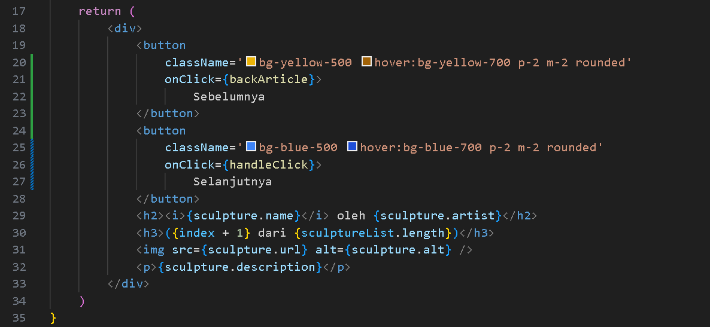

penggunaan ternary operator untuk membuat kondisi seperti yang  di mana jika index baru kurang dari 0, maka value baru akan diset menjadi index terakhir dari list

Praktikum 5

Langkah 1
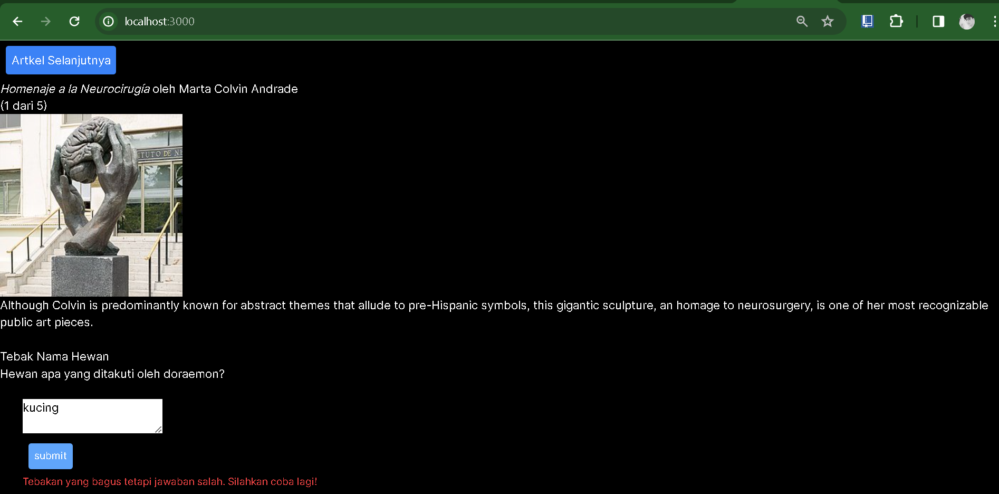
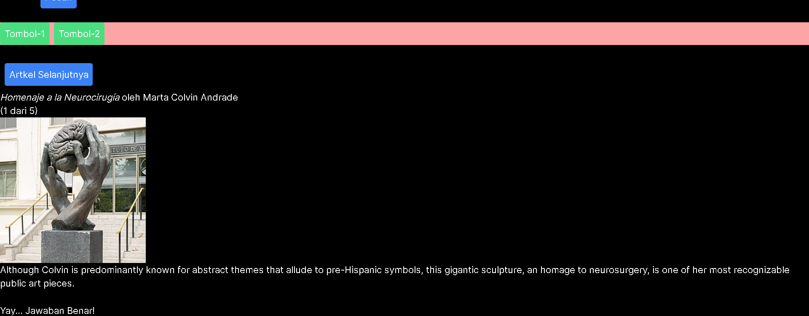

Langkah 2
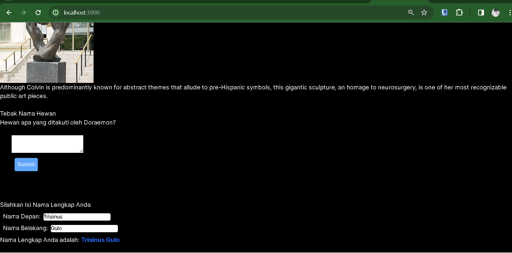

Soal
1. Apa perbedaan dari fungsi Form_2 yang pertama dengan yang kedua?

kedua komponen tersebut adalah fungsi dan state yang digunakan, serta tujuan dari setiap komponen tersebut. Form digunakan untuk menebak jawaban dengan mengirimkan jawaban tersebut dan menangani responsnya, sedangkan Form_2 hanya digunakan untuk mengumpulkan informasi nama lengkap pengguna.

2. Kenapa perlu menghapus state fullName? Apa keuntungannya? -->
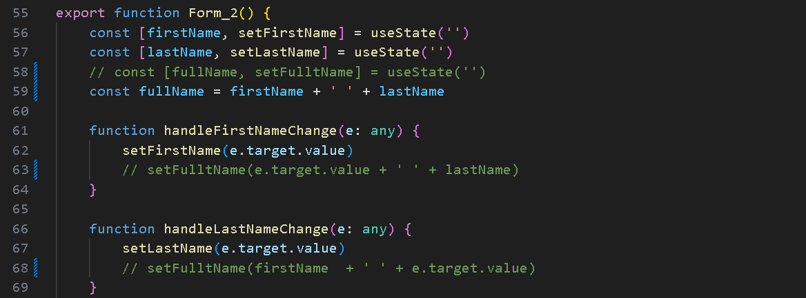
Dengan menghapus state `fullName` dan menggantinya dengan perhitungan langsung setiap kali salah satu dari `firstName` atau `lastName` berubah, Anda dapat meningkatkan kesederhanaan, konsistensi, performa, dan penghematan memori dalam komponen  Ini membuat komponen menjadi lebih sederhana, lebih mudah dipahami, dan lebih efisien dalam penggunaan. 

Praktikum 6

Langkah 1
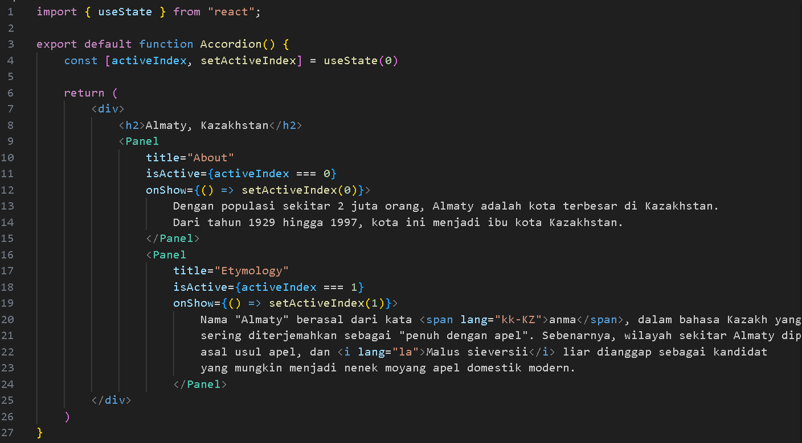

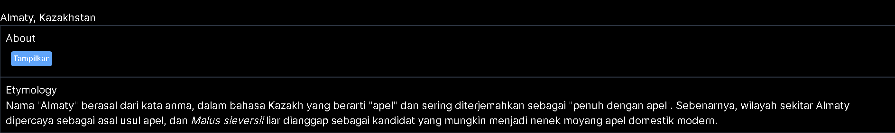

Langkah 2
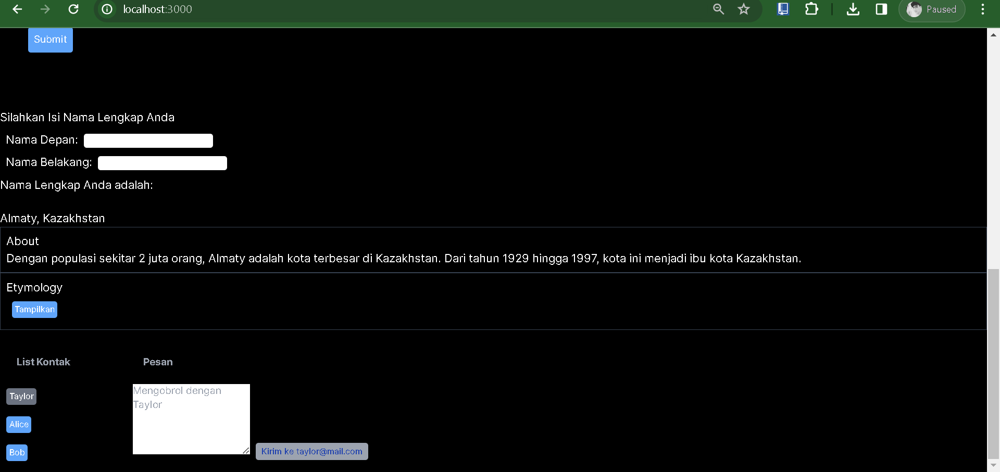

Soal
1. Apa tujuan dari penulisan ini key={to.email} pada < Chat key={to.email} contact={to} / > ?

Penambahan `key={to.email}` pada komponen `<Chat />` dalam struktur JSX `ContactList` tidak memiliki efek karena `<Chat />` tidak diulang dalam suatu daftar. Pemberian kunci (`key`) biasanya diperlukan saat kita melakukan rendering dalam loop dari suatu array, seperti yang dilakukan dalam komponen `ContactList`. Dalam konteks ini, kunci memungkinkan React untuk mengidentifikasi dengan unik setiap elemen dalam daftar dan mengelola perubahan secara efisien. Namun, dalam kasus `<Chat />`, yang mungkin hanya terhubung dengan satu kontak pada suatu waktu, pemberian kunci tidak diperlukan. Ini mungkin merupakan kesalahan penulisan atau bagian dari kode yang tidak relevan dalam implementasi saat ini.

1. Apa fungsi dari props key tersebut?

Penggunaan prop key memungkinkan React untuk mengidentifikasi dengan unik setiap elemen dalam daftar yang dirender secara dinamis. Ketika Anda memiliki daftar elemen yang dirender dalam sebuah loop atau iterasi, React menggunakan kunci ini untuk membedakan setiap elemen, sehingga memungkinkan untuk mengelola perubahan secara efisien.