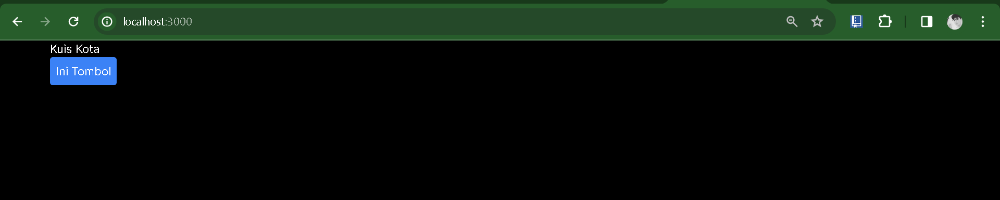
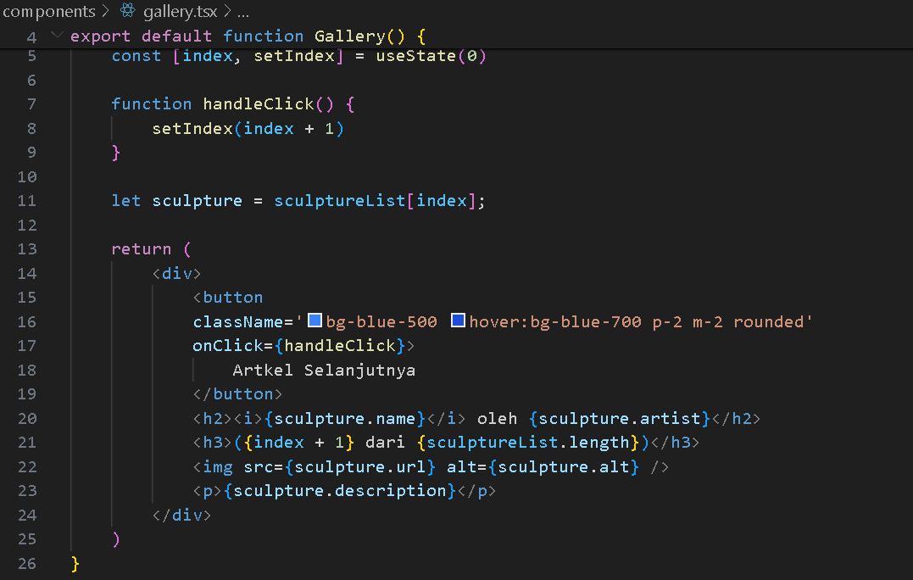

Nama : Trisinus Gulo

Nim : 2141720035

Absen : 14

Pertemuan 4 : PBF

# Praktikum 1 - EVent Hadler

Langkah 1

mencoba membuat tombol sederhana yang belum bisa melakukan apa-apa alias belum bisa  buat event handler untuk tombol tersebut. Sebagai contoh, berikut adalah sebuah tombol yang belum melakukan apa pun. Membuat folder/file baru di src/component/button.tsx

pada file src/app/page.tsx

**Hasil Output**

Langkah 2

Menambahkan event pada tombol tersebut. Seperti contoh kita buat ketika tombol di klik, akan memunculkan notif/alert. Kita dapat membuat pesan ketika pengguna mengeklik dengan mengikuti tiga langkah berikut:

1. Deklarasikan sebuah fungsi bernama handleClick di dalam komponen Button kita.
2. Implementasikan logika di dalam fungsi tersebut (gunakan alert untuk menampilkan pesan).
3. Tambahkan handler onClick={handleClick} ke tag JSX < button >

mengalamai error di karenakan belum melakukan pengaturan komponen untuk mengatasi error tersebuat butuh mengatur agar komponen yang di gunakan menjadi komponen client. Untuk menjadikan komponen client,  cukup memberikan perintah ini "use client"; pada baris pertama file page.tsx

**Hasil Output**

Berhasil di jalankan dan ketika di klink butonnya akan muncul perintah seperti di bawah

# Praktikum 2

Membuat fungsi baru di componect/button tsx

Memodifikasi file page.tsx

Ketika diklik button pesan

**Penjelasan**
- pada praktikum 2 hasilnya sama di praktikum 1 kita cuma memodifikasi kodingannya aja dengan menambahkan button pesan saja
- Pada Praktikum 2 dimana pada kodingan button.tsx untuk export function buttonya untuk isi pesan dan nama tombolnya akan bergaris merah untuk itu saya menambahkan salah satu tipe data yaitu string seperti di bawah ini

      export function Tombol_2({ isiPesan, namaTombol }: { isiPesan: string, namaTombol: string }){

# Praktikum 3

Langkah 1 - Propagation 

Memodifikasi file page.tsx

Langkah 3 - Stop Propagation

# Praktikum 4

langkah 1

akan menampilkan artikel dan juga gambar arkel tersebut 

Langkah 2
Menambahkan Variabel state

pada langkah ini bisa kita megklik  artikel selanjutnya di karenakan melakukan modifikasi pada kodingannya gallery.tsx

